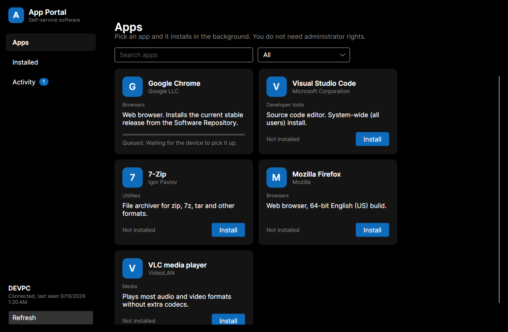

# App Portal

A self-service software catalog for Windows PCs managed with [Action1](https://www.action1.com/). The person at the keyboard opens App Portal, picks an approved app, and the Action1 agent installs it as SYSTEM. No administrator rights on the PC, no installer download, no API credential on the device.



## How it works

```
+-------------------+   device token    +--------------------+   API credential   +-----------------+
| App Portal client | ----------------> | App Portal server  | -----------------> | Action1 cloud   |
| (Windows, Avalonia)|  HTTPS, JSON     | (ASP.NET Core,     |  OAuth2 + REST 3.0 |                 |
+-------------------+                   |  Docker)           |                    +--------+--------+
                                        +--------------------+                             |
                                                                                            v
                                                                                   Action1 agent on the PC
                                                                                   installs the package
```

1. The client reads `%ProgramData%\AppPortal\client.json` for the server URL and this device's token, then shows the catalog.
2. Install sends `POST /api/v1/installs {appId}`. The server checks the token, maps the device to its Action1 endpoint ID, resolves the package version in the Software Repository, and runs a `deploy_package` automation on that one endpoint.
3. The server polls the automation's endpoint result and records Queued, Running, Succeeded, Failed or Cancelled. The client shows progress on the card and the full history under Activity.
4. Installed shows what Action1's software inventory reports for the device, matched back to catalog entries.

The Action1 API credential lives only on the server, injected from 1Password at start. A device token can request installs of catalog apps on its own endpoint and nothing else.

## Why this exists

Action1 announced a Self-Service App Portal in October 2025 and lists it as an upcoming release on its roadmap. Until it ships, this is the gap-filler for a locked-down workstation where AppLocker allows only what lands in Program Files through the management agent. The client itself installs to Program Files for that reason.

## Repository layout

| Path | What |
|---|---|
| `src/AppPortal.Shared` | API contracts shared by client and server |
| `src/AppPortal.Server` | ASP.NET Core minimal API, Action1 client, catalog and device stores, CLI |
| `src/AppPortal.Client` | Avalonia desktop client (Windows target; runs on Linux for development) |
| `tests/AppPortal.Server.Tests` | xUnit tests against an in-memory Action1 stand-in |
| `deploy/` | Dockerfile, compose file, environment template, Windows install script |
| `docs/` | Screenshots and notes |

## Server setup

Requirements: Docker, the 1Password CLI, and an Action1 API credential.

1. **Create the API credential** in the Action1 console under Configuration, API Credentials. Copy the Client ID and Client Secret into a 1Password item together with your organization ID (the `org=` value in the console URL). The server needs `view_endpoints`, `view_software_repository`, `view_installed_software`, `view_automations` and `run_automations`.
2. **Render the environment file** from the template. The op:// references in `deploy/server.env.example` point at that item; adjust the vault, item and field names, then:
   ```bash
   op inject -i deploy/server.env.example -o deploy/server.env
   ```
   `server.env` is gitignored. Set `Action1__BaseUrl` to your region, for example `https://app.na-2.action1.com/api/3.0`.
3. **Write the catalog** in `deploy/config/catalog.json`. See [deploy/config/README.md](deploy/config/README.md). Package IDs must exist in your Software Repository; the checked-in file is a starting point, not a verified list.
4. **Start the server**:
   ```bash
   docker compose -f deploy/compose.yaml up -d --build
   docker compose -f deploy/compose.yaml exec app-portal dotnet AppPortal.Server.dll catalog verify
   ```
   `catalog verify` resolves every package against Action1 and exits non-zero if one is missing.
5. **Register a device.** Find the endpoint ID in the Action1 console (the endpoint's URL) and run:
   ```bash
   docker compose -f deploy/compose.yaml exec app-portal dotnet AppPortal.Server.dll device add --name OBIPC --endpoint-id <endpoint-id>
   ```
   The token prints once. Store it in 1Password; the server keeps only its SHA-256.

Put the server behind TLS (a reverse proxy or your tunnel) before a device on another network uses it. The token is a bearer secret.

## Client deployment

The CI workflow publishes `AppPortal-client-win-x64.zip`: a self-contained build plus `Install-AppPortalClient.ps1`. Deploy it through Action1 as a custom package (or run it as SYSTEM any other way):

```powershell
.\Install-AppPortalClient.ps1 -ServerUrl https://portal.example.internal -DeviceToken <token>
```

The script copies the client to `%ProgramFiles%\App Portal`, writes `%ProgramData%\AppPortal\client.json` readable by Users and writable only by Administrators, adds a Start menu shortcut for all users, and registers an uninstall entry. Pass the token through the RMM's secret parameter rather than embedding it in the package.

## Development

```bash
dotnet test
cd src/AppPortal.Server
ASPNETCORE_ENVIRONMENT=Development dotnet run -- device add --name DEVPC --endpoint-id fake-endpoint-0001
ASPNETCORE_ENVIRONMENT=Development ASPNETCORE_URLS=http://127.0.0.1:5080 dotnet run
```

The Development environment uses `Action1:Mode=Fake`: an in-memory Action1 whose deployments advance one step per status read, so the whole flow runs without a tenant. Then, in another shell:

```bash
cd src/AppPortal.Client
APPPORTAL_SERVER_URL=http://127.0.0.1:5080 APPPORTAL_DEVICE_TOKEN=<token> dotnet run
```

`dotnet run -- --screenshot out.png 2` renders a section (0 apps, 1 installed, 2 activity) to a PNG and exits, which is how the images in `docs/` were produced under Xvfb.

## API

All routes except `/healthz` need `Authorization: Bearer <device token>`.

| Route | Purpose |
|---|---|
| `GET /api/v1/catalog` | Approved apps, without package identifiers |
| `GET /api/v1/device` | The calling device and its Action1 endpoint status |
| `GET /api/v1/device/installed` | Installed software reported by Action1, matched to catalog IDs |
| `GET /api/v1/installs` | This device's install history, active ones refreshed |
| `GET /api/v1/installs/{id}` | One install request, refreshed |
| `POST /api/v1/installs` | `{ "appId": "..." }`, answers 202 with the record; 404 unknown app, 409 already in progress, 422 no matching package version, 429 too many active, 502 Action1 refused |

## Limits

- One catalog for all devices. Per-device or per-group catalogs are not implemented.
- Uninstall is not offered to the user; Action1 supports it and the server could expose it later.
- Device tokens do not expire. Rotate one by running `device add` again for the same name.
- Action1's API is rate limited (HTTP 429). The server polls active installs every 30 seconds by default; keep the catalog small and the device count modest.

## License

MIT. See [LICENSE](LICENSE). Action1 is a trademark of Action1 Corporation; this project is not affiliated with or endorsed by Action1.
