# App Portal

A self-service software catalog for Windows PCs managed with [Action1](https://www.action1.com/). The person at the keyboard opens App Portal, picks an approved app, and the Action1 agent installs it as SYSTEM. No administrator rights on the PC, no installer download, no API credential on the device.

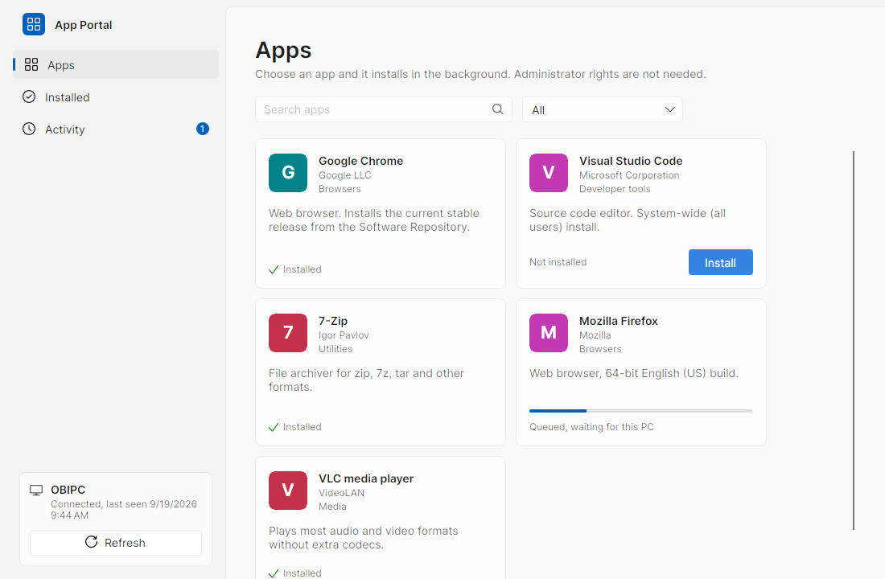

The client follows the Windows 11 design language: a two-layer NavigationView layout with Mica behind the pane, the Fluent 2 color tokens for light and dark, Segoe UI Variable on the Windows type ramp, 4px control and 8px container corner radii, and a 3x16 accent selection indicator. It picks up the system theme automatically.

| Dark theme | Activity |
|---|---|
| 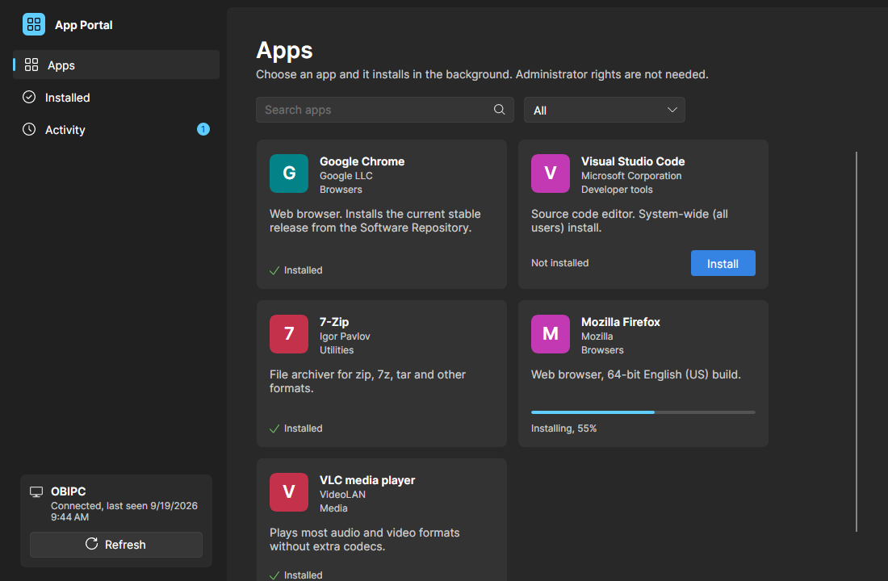 | 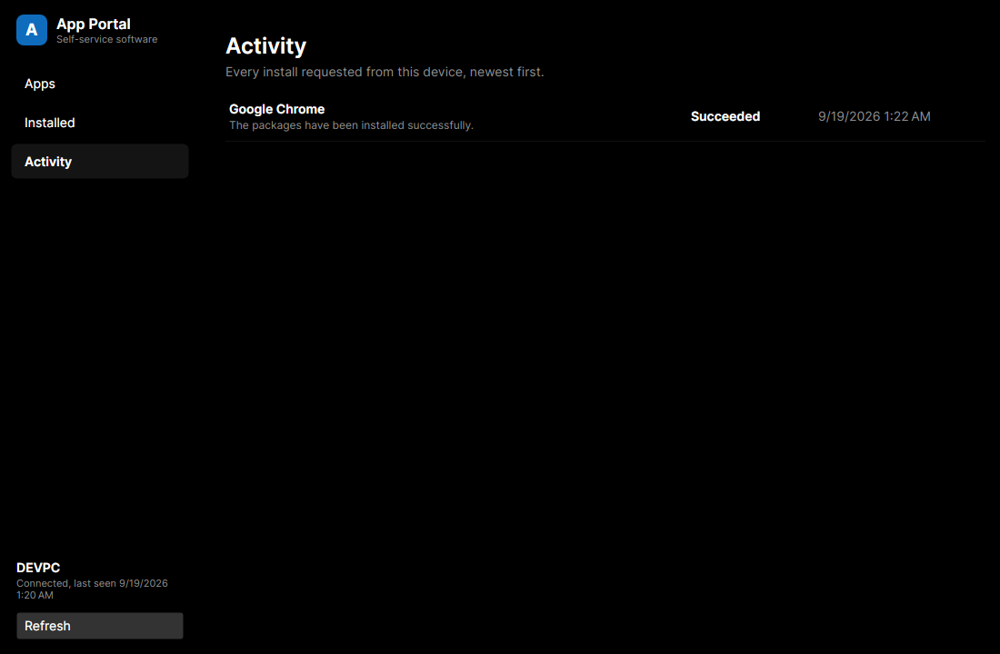 |

## Two install engines

App Portal installs software one of two ways, and a device may have both.

- **action1** — the server asks an Action1 automation to deploy a package to that endpoint. This is what the portal started as, and a fleet already managed by Action1 needs nothing else.
- **agent** — a Windows service running as SYSTEM on the PC installs a winget package or downloads an installer the catalog names, checks its SHA-256, and runs it. A company with no RMM at all can run the portal on this alone.

A server-wide default decides between them when both could serve an app; a catalog app or a device can override it. Every install says which engine ran it, on the card and in the history.

What the agent adds beyond "run an installer":

- **Per-user installs.** A great many Windows installers write into a user profile. The agent runs those in the session of the person who asked, not as the service account, and waits until they are signed in rather than installing into a profile nobody uses.
- **Restarts.** Software whose driver loads at boot is not finished when its installer exits. The install stays open, the person is asked to restart, and it settles itself afterwards.
- **Prerequisites.** A catalog app can name the apps that must go on first. One click installs the chain in order, skipping whatever the PC already has.
- **Requirements.** An app can state what it needs in plain words, and the person confirms it before installing. The portal never checks these and never refuses an install over one.
- **Removal.** Software can come off again, by an administrator always and by the person who installed it when the app allows it.
- **Large downloads.** A multi-gigabyte installer resumes after a dropped connection or a service restart, is verified against its hash, and is cached so a second device on the same image does not fetch it twice.

The portal installs applications and launchers. Content a launcher downloads afterwards for one signed-in account — a game inside a store client, for instance — is outside it: the portal has no account there and does not drive one.

### Where an app comes from

An administrator adds an app by choosing its **Source** on the catalog page and naming the app there; the page shows only the fields that source needs, and a sentence under the form says what saving will do. The person installing it never sees which source it is.

| Source | What it is for | Installs for |
|---|---|---|
| Action1 | A package from your Action1 Software Repository, on a device with an Action1 endpoint. | Everyone |
| winget | Windows applications, from Microsoft's community repository. The default choice for most software. | Everyone, or one person |
| Microsoft Store | Store applications, by their twelve-character product id. Some need the person signed in to the Store before it grants a licence; say so under Requirements. | One person |
| Direct download | Any installer at a URL, checked against its SHA-256. Game launchers and vendor installers that are in no repository. | Everyone, or one person |
| Chocolatey | Windows applications and tools, from the Chocolatey community repository. The closest of these to winget. | Everyone |
| Scoop | Developer tools, into one person's profile without administrator rights. | One person, or everyone with `--global` |
| npm, Yarn | Node.js command line tools. Needs Node.js on the PC. | Everyone, or one person |
| Bun | Node.js packages through Bun. Needs Bun. | One person |
| pip | Python packages and the tools they bring. Needs Python. | Everyone, or one person |
| Cargo | Rust command line tools, built on the PC. Needs Rust. | One person |
| vcpkg | C and C++ libraries into a build tree. For developer machines, not for applications. | The PC |
| .NET tool | Command line tools published to NuGet. Needs the .NET SDK. | One person |
| PowerShell module | A module from the PowerShell Gallery, for PowerShell 7 or for the Windows PowerShell 5.1 every PC already has. | Everyone, or one person |

An app can have an Action1 package and one agent source at once; the catalog page then asks which to use on a device that could use either. Only Action1 and the next four are ways to put an application in front of everybody on a PC. The rest are for developer workstations: reaching for npm to deploy a web browser is a misunderstanding of what npm is.

The portal installs applications and launchers. What a launcher then downloads for one signed-in account, a game in a Steam library or a Riot client's own updates, belongs to that launcher and that account, and is outside the portal: add Steam or the Riot client to the catalog, not the games inside them.

A package manager has to be on the PC before anything can be installed through it, and none of them are on a fresh Windows install. Add the manager itself to the catalog, from winget or a direct download, and list it under **Requires** on the apps that need it: the portal then installs it first, once, and skips it on every PC that already has it. An install through a manager the PC lacks fails with a sentence naming the manager, rather than an exit code.

A package id goes onto a command line, and npm, Yarn and Scoop are batch files that Windows runs through `cmd.exe`. The catalog therefore accepts only the characters a real package id uses for that manager, and refuses anything a command prompt would read as an instruction. Extra arguments are passed through as the administrator typed them.

## How it works

```
+-------------------+   device token    +--------------------+   API credential   +-----------------+
| App Portal client | ----------------> | App Portal server  | -----------------> | Action1 cloud   |
| (Windows, Avalonia)|  HTTPS, JSON     | (ASP.NET Core,     |  OAuth2 + REST 3.0 |                 |
+-------------------+                   |  Docker)           |                    +--------+--------+
                                        +--------------------+                             |
                                                                                            v
                                                                                   Action1 agent on the PC
                                                                                   installs the package
```

1. The client reads `%ProgramData%\AppPortal\client.json` for the server URL and this device's token, then shows the catalog.
2. Install sends `POST /api/v1/installs {appId}`. The server checks the token, maps the device to its Action1 endpoint ID, resolves the package version in the Software Repository, and runs a `deploy_package` automation on that one endpoint.
3. The server polls the automation's endpoint result and records Queued, Running, Succeeded, Failed or Cancelled. The client shows progress on the card and the full history under Activity.
4. Installed shows what Action1's software inventory reports for the device, matched back to catalog entries.
5. Requests lets the user ask for software outside the catalog. An administrator approves or denies the request in the browser; the client shows the decision and reason on its next refresh.

The server stores the catalog, devices, install history, requests and admin accounts in one SQLite database on the data volume. The client sends `X-AppPortal-User: DOMAIN\user` with API calls so installs and requests record who asked. This account name is a client-supplied label; the device token authenticates the call.

The Action1 API credential lives only on the server, supplied through its environment at start. A device token grants access to the catalog, installs and requests for that device; it cannot administer the portal or act on another endpoint.

## Why this exists

Action1 announced a Self-Service App Portal in October 2025 and lists it as an upcoming release on its roadmap. Until it ships, this is the gap-filler for a locked-down workstation where AppLocker allows only what lands in Program Files through the management agent. The client itself installs to Program Files for that reason.

## Try it without a server

Demo mode fills the whole interface with sample data held in memory. Installs advance through queued, installing and installed over about twelve seconds, then appear under Installed. Nothing is installed on the machine and nothing leaves it.

From a clone, with the .NET SDK and nothing else:

```bash
dotnet run --project src/AppPortal.Client -- --demo
```

An installed client does the same with `"%ProgramFiles%\App Portal\AppPortal.exe" --demo`, which is how the release gate proves the packaged build renders on Windows.

## Repository layout

| Path | What |
|---|---|
| `src/AppPortal.Shared` | API contracts shared by client and server |
| `src/AppPortal.Server` | ASP.NET Core minimal API, Action1 client, SQLite storage and migrations, CLI |
| `src/AppPortal.Client` | Avalonia desktop client (Windows target; runs on Linux for development) |
| `tests/AppPortal.Server.Tests` | xUnit tests against an in-memory Action1 stand-in |
| `tests/AppPortal.Client.Tests` | Client catalog refresh regression tests |
| `tests/AppPortal.Agent.Tests` | xUnit tests for enrollment, heartbeats, the install engines and self-update |
| `src/AppPortal.Agent` | SYSTEM service for enrollment, heartbeats, installs and self-update from GitHub releases |
| `src/AppPortal.Installer` | WiX v5 MSI, built and verified on Windows |
| `src/AppPortal.Setup` | `AppPortalSetup.exe`: the wizard and silent installer that carries the MSI |
| `tests/AppPortal.Setup.Tests` | xUnit tests for the wizard's arguments, exit codes and enrollment wait |
| `deploy/` | Dockerfile, compose file, environment template, server smoke test and the Windows installer test |
| `docs/` | Screenshots and design notes |

## Server setup

Requirements: Docker and an Action1 API credential. A secrets manager whose CLI can render an environment file from references is the comfortable way to keep the credential, but any way of writing three lines into a mode-600 file works.

1. **Create the API credential** in the Action1 console under Configuration, API Credentials. Store the Client ID and Client Secret in your secrets manager together with your organization ID (the `org=` value in the console URL). The server needs `view_endpoints`, `view_software_repository`, `view_installed_software`, `view_automations` and `run_automations`.
2. **Write the environment file.** Copy `deploy/server.env.example` to `deploy/server.env`, which is gitignored, and fill in the three `Action1__` values, either by hand or by rendering the file from your secrets manager's references. Keep it mode 600; it is the only place the credential exists on the host.
3. **Start the server**:
   ```bash
   docker compose -f deploy/compose.yaml up -d
   ```
   This pulls `ghcr.io/duresa7/app-portal-server`. Put `APP_PORTAL_VERSION=0.3.0` in `deploy/.env` to pin the release, or add `--build` to build from the checkout. The checked-in catalog seeds an empty database; its package IDs are examples and must be verified against your Action1 Software Repository.
4. **Create the first administrator**:
   ```bash
   docker compose -f deploy/compose.yaml exec app-portal dotnet AppPortal.Server.dll admin add --username admin
   ```
   Enter the password at the prompt. For unattended setup, supply `APPPORTAL_ADMIN_PASSWORD` through the process environment. Open `/admin` on the server, sign in, and manage further accounts under **Admins**.
5. **Prepare the catalog.** Open **Catalog** to add or edit apps, search and verify Action1 packages, or import a JSON catalog. Hide removes an app from the device catalog while retaining its history; delete is refused when installs reference it. Export downloads the current catalog. See [the catalog format](deploy/config/README.md).
6. **Create an enrollment key.** Open **Enrollment keys**, choose its expiry and use limit, and copy the key shown once. Pass it to the MSI through your deployment system's secret parameter. The agent exchanges it for a device token at first start; the server must expose the milestone 2 enrollment endpoint. Manual device registration remains available for older clients.

The CLI remains available for scripts:

```bash
docker compose -f deploy/compose.yaml exec app-portal dotnet AppPortal.Server.dll catalog import /app/config/catalog.json
docker compose -f deploy/compose.yaml exec app-portal dotnet AppPortal.Server.dll catalog export
docker compose -f deploy/compose.yaml exec app-portal dotnet AppPortal.Server.dll catalog verify
docker compose -f deploy/compose.yaml exec app-portal dotnet AppPortal.Server.dll device add --name OBIPC --endpoint-id <endpoint-id>
```

Put the server behind TLS (a reverse proxy or your tunnel) before a device on another network uses it. The token is a bearer secret.

## Administration

There are two places to administer the portal, and they do the same things:

- **The web admin**, at `/admin` on the server. Use it from any browser, including from a PC that has no App Portal on it.
- **The Admin area of the Windows client.** Choose **Admin** at the foot of the pane and sign in with the same administrator account. Use it on a PC that already runs the client, so you do not have to find the server's address. The client stays signed in for that Windows account until you sign out or the session is revoked; the token is encrypted for that account and is never written to `client.json`.

Both sign in with a local administrator account (or a directory account, below). Browser sessions use cookies and forms require antiforgery tokens. The client uses an `apa_` bearer token from the admin JSON API; device tokens cannot open either. Every action on a web admin page has a counterpart in the client.

| | |
|---|---|
| 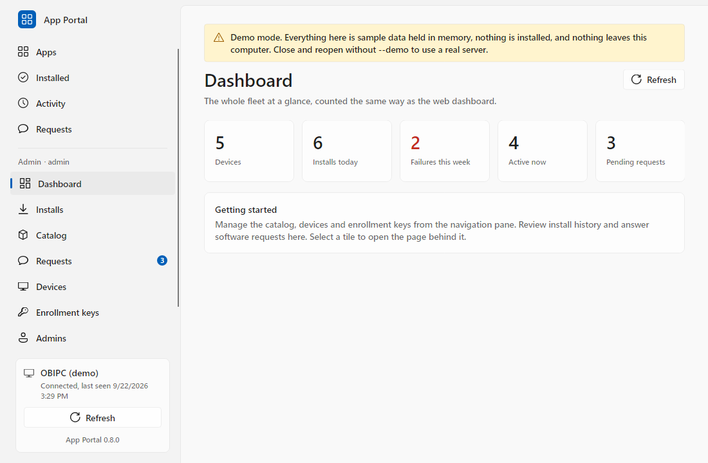 | 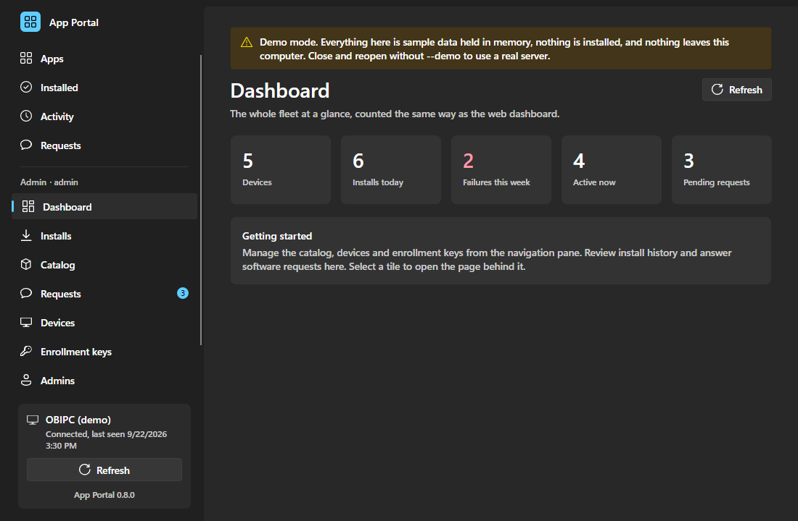 |
| 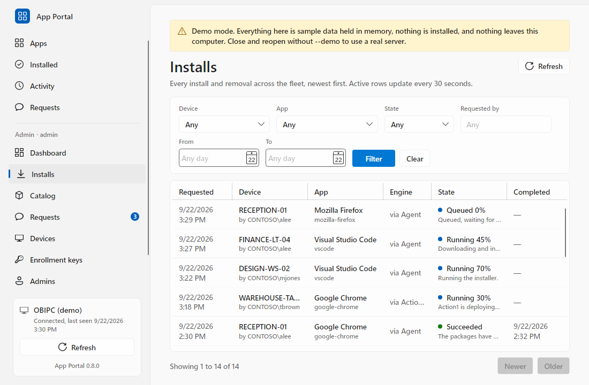 | 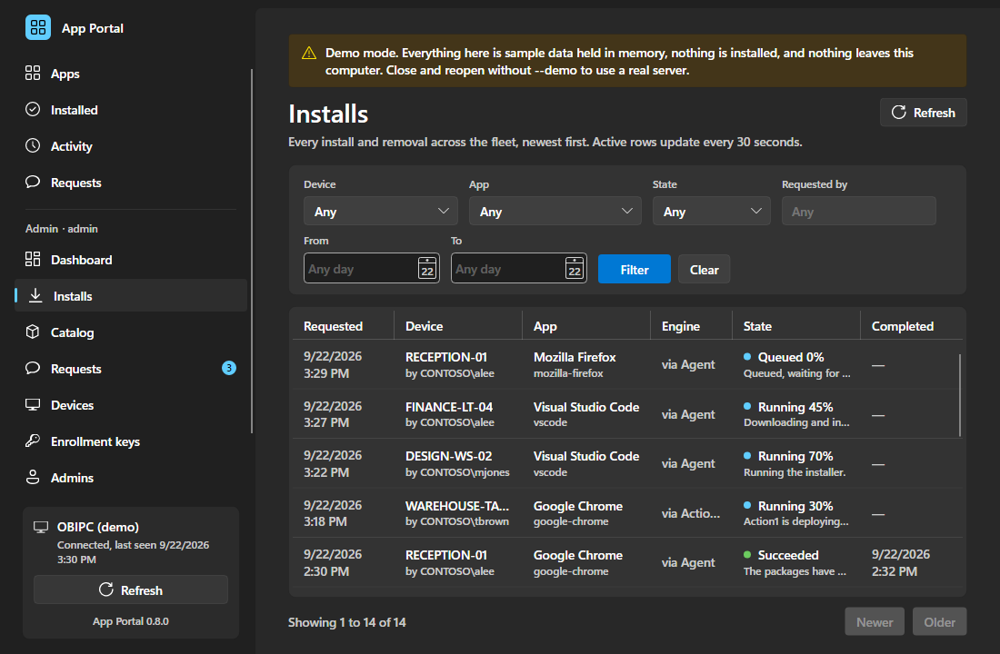 |
| 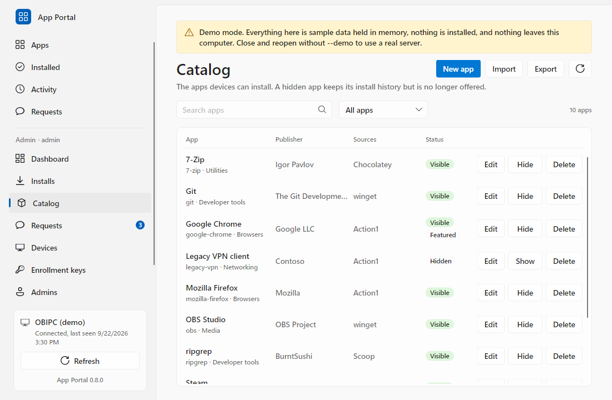 | 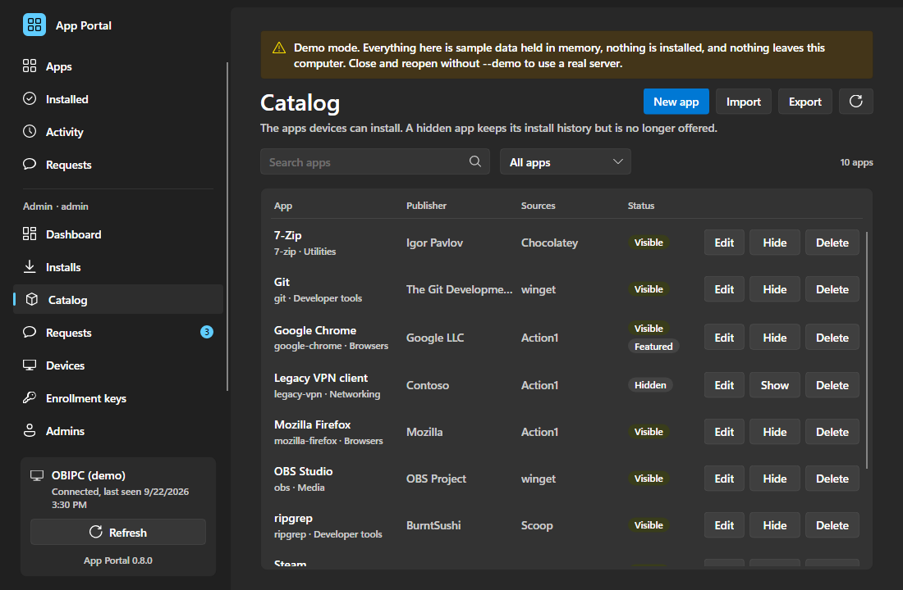 |
| 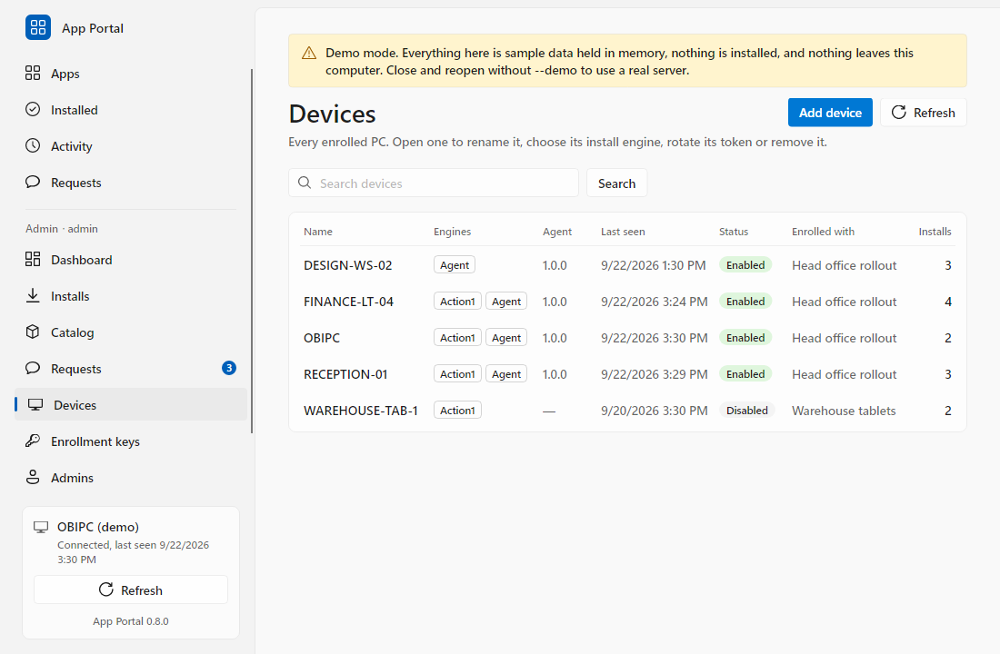 | 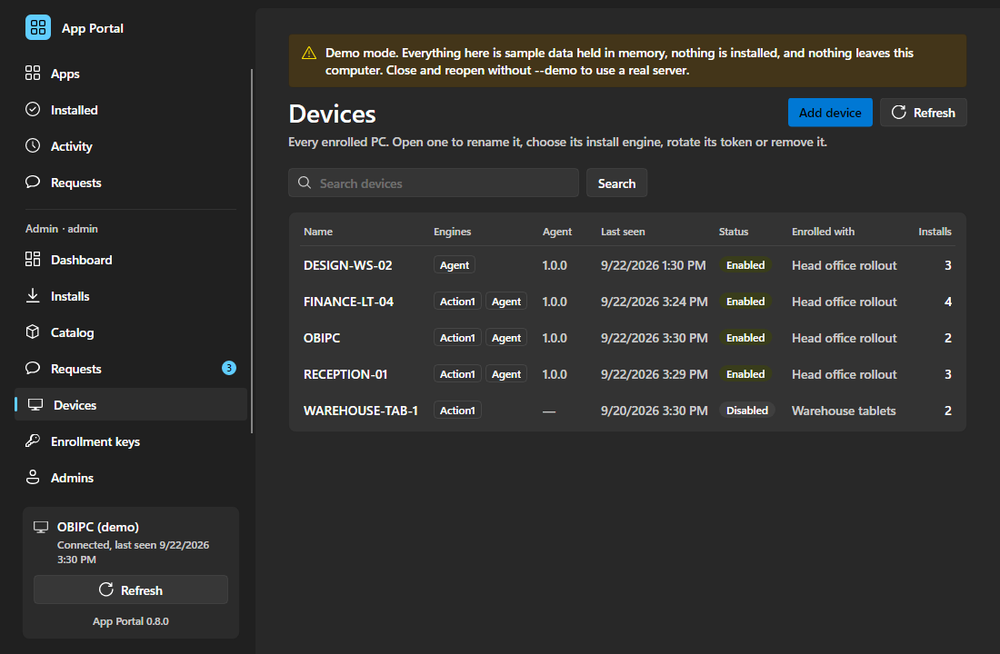 |

`AppPortal.exe --demo` opens the client with sample data held in memory; the demo administrator is `admin` with the password `demo`. The pages below are the web admin.

**Installs** shows fleet-wide history with device, requester, app, engine, state and dates. Filter by device, app, state, requester or date range; the table refreshes every 30 seconds.

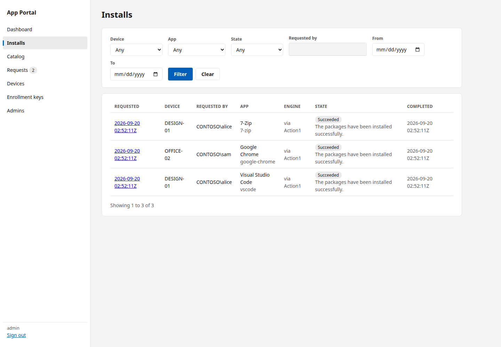

**Catalog** manages approved software. Edits appear in the client on its next refresh, including changes to existing cards.

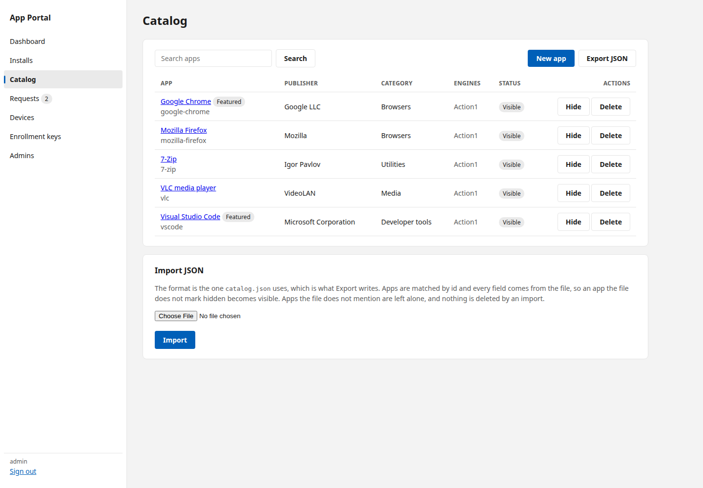

**Requests** shows pending and decided software requests. Approve or deny with an optional reason of up to 500 characters. An approval can name the catalog app that answers it, or open the create form prefilled from the request; the requester's client then offers that app. Approval never starts an installation.

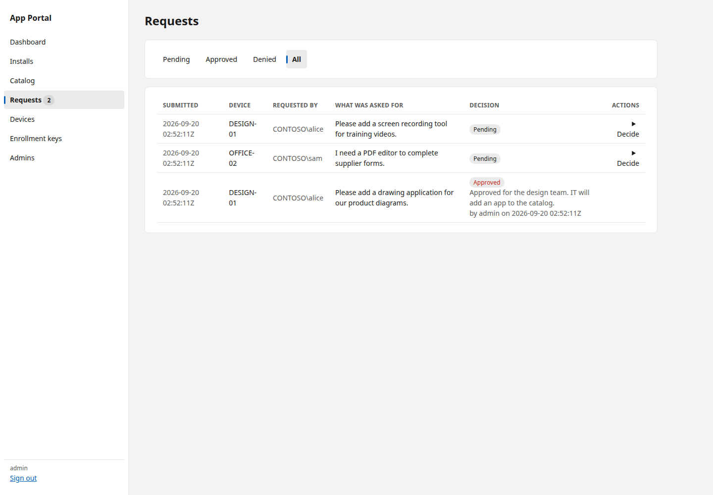

**Devices** supports renaming, disabling, token rotation and removal. Disabling or rotating a token takes effect on the next API call. Removal is refused while an install is active; afterward, install and request history remains available to administrators. A replacement device does not inherit the retired device's history.

**Enrollment keys** lets administrators create and revoke keys with an expiry, use limit and default engine. The full key appears once. The MSI and agent use these keys with the milestone 2 enrollment API; a 0.3.0 server still needs manual device registration.

### Directory sign-in (optional)

The portal needs no directory. A deployment that already runs Active Directory can let administrators sign in with their domain account instead of a second password, by configuring the `Directory` section:

```jsonc
"Directory": {
  "Enabled": true,
  "Servers": ["dc01.ad.example.com", "dc02.ad.example.com"],
  "Port": 636,
  "NetBiosDomain": "EXAMPLE",
  "RequiredGroup": "APP-AppPortal-Admins",
  "CertificateThumbprints": ["<sha-256 of the controller certificate>"],
  "CertificateFile": "/app/config/dc-certs.pem",
  "TimeoutSeconds": 10
}
```

How it behaves:

- **Local accounts are checked first**, so a directory that is unreachable cannot lock you out of your own portal. Keep one local account.
- The bind is **LDAPS only** and uses the signing-in user's own credentials; the server holds no service account.
- Only members of `RequiredGroup` are admitted, nested groups included. There is no default group: leaving it empty stops the server rather than admitting the whole directory.
- A forest with no certificate authority gives its controllers self-signed certificates. List their SHA-256 thumbprints in `CertificateThumbprints`: the server opens the TLS connection and compares the certificate before any password is sent, and refuses a mismatch. On Linux the bind itself is performed by OpenLDAP, which validates separately against `CertificateFile`, a PEM holding the controller certificates; set both. With neither, ordinary chain validation applies and a self-signed certificate is refused.
- The first successful sign-in creates an administrator row named `DOMAIN\user`, matching the requester label on installs. Disable it like any other account; its password stays in the directory and cannot be set here.
- Every administrator is a full administrator. There is no group-to-role mapping, no directory sync, and the Windows client does not use this.

Sign in with `DOMAIN\user`, a UPN, or the bare user name when `NetBiosDomain` is set; all three resolve to the same administrator account. Configure the section through the environment like any other setting, for example `Directory__Enabled=true` and `Directory__Servers__0=dc01.ad.example.com`. The controllers are addressed by name, because that is what their certificates carry, so they must resolve and answer on 636 from inside the container. If the Docker host's resolver does not serve the directory's zone, copy `deploy/compose.override.example.yaml` to `deploy/compose.override.yaml`, fill in the addresses, and pass both files to `docker compose`. Put the certificate file in `deploy/config/`, which is already mounted read-only at `/app/config`.

## Upgrading from 0.2.x

Stop the old container and back up both the data volume and `deploy/config` before starting 0.3.0. Keep the existing volume mounted at `/app/data` and the catalog available at `/app/config/catalog.json` for the first start. The server imports `devices.json`, `installs.json` and the catalog into `app-portal.db`; existing device tokens remain valid. Verify the device list, catalog and install history, then create the first administrator with `admin add`.

After verification, archive the legacy JSON files outside the mounted directories. The config volume no longer needs `catalog.json`: edits now live in SQLite, and explicit CLI or browser imports remain available. Leaving legacy files in place can seed a table again if it becomes empty. Back up the data volume while the server is stopped, including the database and admin authentication keys. To roll back, restore the pre-upgrade backup and old image; 0.2.x does not read SQLite.

The upgrade was checked using a copy of a data volume written by the 0.2.1 server in fake mode. Its original token authenticated after migration, catalog and install records remained available, and a restart produced no duplicate records.

## Install one PC with Setup.exe

`AppPortalSetup.exe` is the whole product in one file: the MSI, the .NET runtime and a four-page wizard. Carry it to a machine, double-click it, answer two questions, and the PC is enrolled. Every release attaches it beside the MSI.

It asks for the server address and an enrollment key, checks both against the server before it installs anything, and asks for an Action1 endpoint id only when the key enrolls devices through Action1. It then runs the MSI, waits up to a minute for the agent to enroll and report in, and names the device as the server recorded it. Enter moves to the next page and Escape cancels, so the whole path works from the keyboard.

It requests elevation on launch, unpacks the MSI to `%TEMP%` and deletes it afterwards, and installs nothing of itself. The verbose Windows Installer log stays at `%TEMP%\AppPortal-Setup.log`, which is what the failure page points at.

Deployment systems that prefer an exe to an MSI can use silent mode from an elevated context:

```powershell
AppPortalSetup.exe /quiet /server https://portal.example.internal /key ape_... [/endpoint <endpoint-id>]
```

| Exit code | Meaning |
| --- | --- |
| 0 | Installed and enrolled |
| 1 | Enrollment failed: the key was refused, or the PC never checked in |
| 2 | The command line was wrong |
| 1620 | This build of `AppPortalSetup.exe` carries no MSI |
| 3010 | Installed, and the PC has to restart to finish |
| other | The code `msiexec` returned |

`/quiet` needs both `/server` and `/key`. Property values must not contain quotes, backslashes, tabs or line breaks, the same rule the MSI applies; setup refuses them before it installs rather than after.

## Deploy the MSI

The MSI is what a fleet rollout uses; `AppPortalSetup.exe` above wraps this same package for one machine at a time. Download `AppPortal-<version>-x64.msi` from the [latest release](https://github.com/Duresa7/app-portal/releases/latest). Run it elevated or as SYSTEM through Group Policy, Intune or your RMM:

```powershell
msiexec /i AppPortal-0.6.0-x64.msi /qn SERVERURL=https://portal.example.internal ENROLLMENTKEY=ape_...
```

Use the filename matching the release version. `ACTION1ENDPOINTID=<endpoint-id>` is optional. Pass the key through the deployment system's secret parameter. Property values must not contain quotes, backslashes, tabs or line breaks; percent-encode special characters in the URL.

The MSI installs the client and agent to `%ProgramFiles%\App Portal`, registers `AppPortalAgent` as an automatic SYSTEM service, and adds an all-users Start menu shortcut and an Apps & Features entry. It writes `%ProgramData%\AppPortal\enroll.json` only when both `SERVERURL` and `ENROLLMENTKEY` are supplied. Only SYSTEM and Administrators can read that file. On first start, the agent calls `POST /api/v1/enroll`, writes `client.json` with the returned device token, and deletes `enroll.json`. Users can read `client.json` but cannot change it. An existing token is preserved and any new enrollment file is discarded. Failed enrollment retains the key file and retries.

Upgrade silently with `msiexec /i AppPortal-<new-version>-x64.msi /qn`; no enrollment properties are needed. The token and local data survive, and the service restarts. Uninstall with `msiexec /x AppPortal-<version>-x64.msi /qn`. Data under `%ProgramData%\AppPortal` stays unless you also pass `REMOVEDATA=1`.

`AppPortal-client-win-x64.zip` is gone from 0.6.0 onwards, and the PowerShell installer scripts with it. A PC put on from one of those zips cannot reach this release by itself: the updater it carries replaces files by renaming them, which is not how an MSI arrives. Move those machines once by deploying `AppPortal-0.6.0-x64.msi` through whatever channel the zip went through. The MSI reuses the existing `client.json`, so the device keeps its token and does not enroll twice, and the agent clears what the zip left behind the first time it starts. From there the agent keeps the machine current on its own.

The **Agent** column on `/admin/devices` is how to find the machines that need this. Only the agent's enrollment and heartbeat write that column, so a device showing `—` has never run one and is still a zip installation. Those PCs go on working at the version they have and keep their place in the portal; they simply never move again, and they say nothing about it, so look rather than wait to notice.

The client's **Requests** section accepts up to 500 characters describing the software needed. Each device can have 20 pending requests. The newest request appears immediately after submission; status and administrator reasons refresh with the rest of the client. When an administrator answers a request with a catalog app this PC is offered, the request shows **Show in Apps**, which opens Apps on that app so it installs from its card as usual.

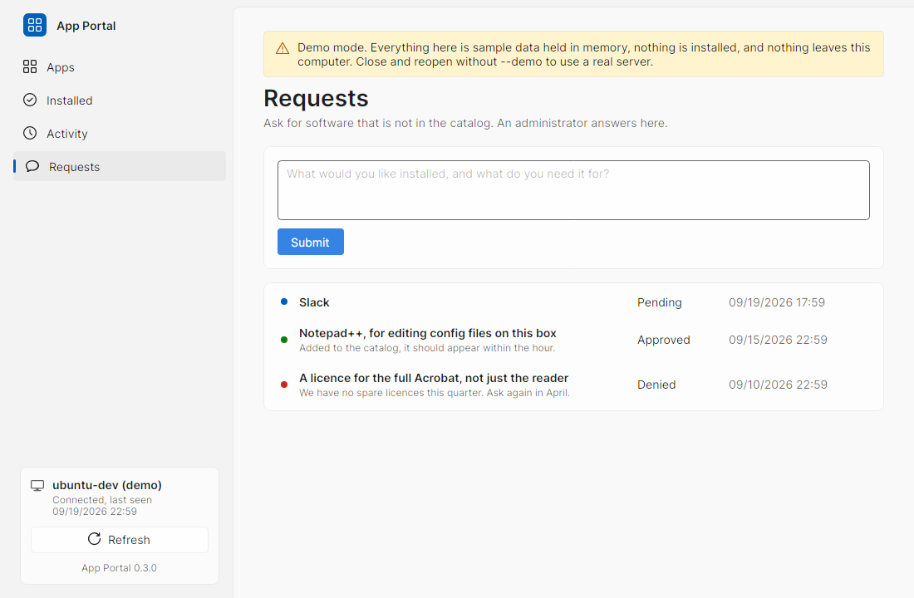

## Checking a download

Every release lists the SHA-256 of its MSI and of `AppPortalSetup.exe` in `SHA256SUMS`. Compare a download with it before deploying:

```powershell
Get-FileHash -Algorithm SHA256 .\AppPortal-<version>-x64.msi
```

From the first signed release onwards, the MSI, `AppPortalSetup.exe` and the App Portal executables and libraries inside them carry an Authenticode signature too. Check it in PowerShell:

```powershell
Get-AuthenticodeSignature .\AppPortalSetup.exe | Format-List Status, StatusMessage, SignerCertificate, TimeStamperCertificate
Get-AuthenticodeSignature .\AppPortal-<version>-x64.msi | Format-List Status, StatusMessage, SignerCertificate, TimeStamperCertificate
```

Expect `Valid`, a signer that begins `CN=SignPath Foundation`, and a timestamp. In Explorer the same is under the file's **Properties**, **Digital Signatures** tab.

The publisher is SignPath Foundation, not the project's author, because the certificate is the foundation's: it signs open-source projects for free and holds the key. What its signature attests is that the file was built by this repository's workflow on a GitHub-hosted runner, from a `v*` tag, and that the owner approved the signing request by hand. See the code signing policy below. Releases before the first signed one carry no signature, and `SHA256SUMS` is the only check they have.

A signature is not a SmartScreen pass. A newly published file can still get a SmartScreen prompt until it has built up reputation, but the prompt names SignPath Foundation instead of "Unknown publisher".

## Code signing policy

Free code signing provided by [SignPath.io](https://about.signpath.io), certificate by [SignPath Foundation](https://signpath.org).

- Committers and reviewers: the repository's maintainers, [Duresa7](https://github.com/Duresa7). A change from anybody else arrives as a pull request and is reviewed by a maintainer before it is merged.
- Approvers: [Duresa7](https://github.com/Duresa7), who approves every release signing request by hand.

What is signed: `AppPortal.exe`, `AppPortal.dll`, `AppPortal.Shared.dll`, `AppPortal.Agent.exe`, the MSI and `AppPortalSetup.exe`, the project's own files and nothing a third party published. The release workflow builds them on a GitHub-hosted runner and submits them to SignPath in build order, payload, MSI, then bootstrapper, so each package carries files that are already signed.

Privacy: App Portal sends data only to systems its administrator configures: the App Portal server named at install, GitHub's release feed for updates, and the package sources in the catalog. It sends nothing to the project's authors or to SignPath.

## Updates

The agent keeps the whole installation current, itself included. It asks GitHub for the newest release when the service starts, once a day at a random second in the noon hour, and within ten seconds of a client asking. The random second keeps a site's worth of machines from arriving together. A release newer than what is installed is downloaded as `AppPortal-<version>-x64.msi`, checked against that release's `SHA256SUMS`, and kept under `%ProgramData%\AppPortal\updates`. Anything that does not match its published hash is discarded.

Applying it needs the client closed, because Windows Installer cannot replace files a running process holds open. With nothing open the agent runs `msiexec /i <msi> /qn /norestart /l*v update-<version>.log` as SYSTEM straight away. With a client open it waits, and that client shows **Restart to update**. Older MSIs are deleted after a successful install; a failure keeps the log beside the MSI and is reported rather than retried differently.

`%ProgramData%\AppPortal\update.json` is what the client's banners read: the installed version, the newest published one, the one waiting to be applied, and a result of `UpToDate`, `Available`, `Installed`, `Offline` or `Failed`. The client never reaches the release feed itself. All it can do is leave `update.request` in the same folder, which the agent takes and deletes within ten seconds; the download and the install are the agent's, as SYSTEM. So that a signed-in user can leave that file, the agent grants the Users group the right to add a file to that one folder and nothing else, which leaves `client.json` and `enroll.json` as they were.

Before it runs or stages an MSI, the agent also checks who signed it. The rule starts with the first signed agent: an agent that is itself validly signed installs only an MSI validly signed by the same publisher, and refuses anything else with `Failed` and the reason in `update.json`, leaving the file unrun. An agent that is not signed, which is every release before the first signed one, a build its owner compiled, and a test-signed rehearsal, checks updates by their SHA-256 alone, as before. The publisher is not written into the agent; it is whoever signed the running agent, so a self-hoster who signs with their own certificate gets the same protection. The decision is recorded in [ADR 0002](docs/adr/0002-a-signed-agent-takes-only-signed-updates.md).

Going back to unsigned builds is deliberate work: deploy an unsigned MSI to the fleet once by hand, the same way the fleet was first deployed. After that the agents are unsigned and check updates by SHA-256 alone again. The same applies to a signed fleet pointed at a fork whose releases are unsigned or signed by somebody else.

An `"updateRepository": "owner/name"` in `client.json` points a test fleet at a fork. `AppPortal.Agent.exe --check` prints what that repository publishes, and which signature rule this agent applies, and downloads nothing.

A PC upgraded from a zip installation still carries three things Windows Installer knows nothing about: the **App Portal Updater** scheduled task, `AppPortal.Updater.exe` and `Uninstall-AppPortalClient.ps1` in `%ProgramFiles%\App Portal`, and an `AppPortalClient` entry in Apps & Features. The agent removes all three on its first start. The task and the updater would otherwise go on replacing files Windows Installer now owns. The entry is worse than that: it puts a second **App Portal** row beside the MSI's, and removing through it runs the retired script, which deletes both `%ProgramFiles%\App Portal` and `%ProgramData%\AppPortal` while Windows Installer still holds the product as installed. A machine upgraded before the agent knew to do this is put right the first time it starts an agent that does.

## Development

```bash
dotnet test
cd src/AppPortal.Server
ASPNETCORE_ENVIRONMENT=Development dotnet run -- device add --name DEVPC --endpoint-id fake-endpoint-0001
ASPNETCORE_ENVIRONMENT=Development ASPNETCORE_URLS=http://127.0.0.1:5080 dotnet run
```

The Development environment uses `Action1:Mode=Fake`: an in-memory Action1 whose deployments advance one step per status read, so the whole flow runs without a tenant. Then, in another shell:

```bash
cd src/AppPortal.Client
APPPORTAL_SERVER_URL=http://127.0.0.1:5080 APPPORTAL_DEVICE_TOKEN=<token> dotnet run
```

The version every project carries is in `Directory.Build.props`; a release build gets the tag's version from CI through `-p:Version=`, and the agent compares that with the installed file version, so tag `v0.6.0` must ship binaries that report 0.6.0.

`dotnet run -- --screenshot out.png 2 --theme dark` renders a section (0 apps, 1 installed, 2 activity, 3 requests) in the chosen theme to a PNG and exits, which is how the images in `docs/` were produced under Xvfb.

The Windows-only installer project is intentionally outside `AppPortal.sln`, so the solution builds and tests on Linux. On Windows, publish `src/AppPortal.Client` and `src/AppPortal.Agent` with `-c Release -r win-x64 --self-contained` to `out/client` and `out/agent`, then run `dotnet build src/AppPortal.Installer/AppPortal.Installer.wixproj -c Release -o out/installer`. Its version comes from `Directory.Build.props`.

Before pushing, `dotnet format` puts the code in the shape CI checks for, and `deploy/smoke-test.sh <image>` runs the same server smoke test CI runs against a locally built image.

## Releasing

CI runs in two shapes, because Windows minutes bill at several times the Linux rate and the Windows jobs are most of the cost of the workflow.

- **Every push and pull request:** the format check, build and tests on Linux, and the server image built and exercised in fake mode.
- **Before a release:** the same plus everything on Windows. A `v*` tag runs it automatically; at any other time start it from the Actions tab with the *Run the Windows jobs as well* box ticked. Treat a red result there as blocking the tag.

The Windows half is what proves the thing a PC actually receives. `build-windows` publishes the client and the agent and builds the MSI and the bootstrapper, always on a GitHub-hosted runner. `installer-verify` then downloads exactly those files, wherever the `WINDOWS_RUNNER` repository variable sends it, and runs [`deploy/windows/ci-installer-test.ps1`](deploy/windows/ci-installer-test.ps1) against a fake-mode server started in the job: the MSI must report the props version and the unchanging upgrade code, `AppPortalSetup.exe /quiet` must return 0, the service must come up as SYSTEM, the device must enroll and appear on `/admin/devices` with a heartbeat, the installed client must render, the uninstall must leave nothing behind, and an install of the previous release must upgrade in place without losing its device token. The script takes the same arguments by hand, so a failure that only reproduces on a virtual machine can be chased there:

```powershell
./deploy/windows/ci-installer-test.ps1 -Msi out/installer/AppPortal-0.5.0-x64.msi -Version 0.5.0 -Setup out/setup/AppPortalSetup.exe -Signing Off
```

It installs and uninstalls software and writes to `%ProgramData%`, so run it on a throwaway machine. `-Signing Test` or `-Signing Release` also fails the run on any App Portal file, packaged or installed, that lacks the signature that mode promises; `Off`, the default, only reports.

Signing through SignPath Foundation is switched by repository settings, never by a file. With the `SIGNPATH_ORGANIZATION_ID` variable and the `SIGNPATH_API_TOKEN` secret both set, a `v*` tag is release-signed and a run of `main` started from the Actions tab with *sign* ticked is test-signed, as a rehearsal. Every other run, including every pull request, fork and branch, builds unsigned; without the variable, so does everything. The variable set without the secret fails the run in its first job rather than shipping unsigned. `SIGNPATH_PROJECT_SLUG` overrides the project name `app-portal` if SignPath's differs.

On a tag with signing on, `build-windows` submits three signing requests in order, the payload, the MSI, then `AppPortalSetup.exe`, because each package carries the one before it. The owner approves each in SignPath as it arrives, within an hour of its submission. A run that timed out is re-run with *Re-run failed jobs*, which submits fresh requests. Once a signed release exists, a tag that would publish an unsigned one fails in `installer-verify`: every agent the signed release installed would refuse it.

A release is cut by tagging:

```bash
# Directory.Build.props already says 0.6.0 and that commit is on main
git tag v0.6.0 && git push origin v0.6.0
```

The tag run repeats all of the above, then a final job pushes `ghcr.io/duresa7/app-portal-server:0.6.0` and `:latest` and creates the GitHub release with the MSI, `AppPortalSetup.exe` and `SHA256SUMS`. Nothing a device or a server host can pull exists before that job, so a failure anywhere leaves no release. The run refuses a tag whose version differs from `Directory.Build.props` or whose commit is not on main. A repository ruleset lets only administrators create, move or delete `v*` tags.

Two things CI cannot do:

- **Package visibility.** The first push creates the GHCR package private. Open the package's settings once, under Package settings, Danger Zone, and change visibility to public so a server host can pull without a token.
- **Yanking a bad release.** Clients only move forward and discard the previous build, so a release that reaches devices cannot be recalled. Delete the release and its tag so no further device picks it up, fix, bump the version and tag again. Devices that already updated get the fix on their next check.

## API

Device routes below need `Authorization: Bearer <device token>`. `/healthz` is public; admin session routes use the credentials described separately.

| Route | Purpose |
|---|---|
| `GET /api/v1/catalog` | Approved apps, without package identifiers |
| `GET /api/v1/device` | The calling device and its Action1 endpoint status |
| `GET /api/v1/device/installed` | Installed software reported by Action1, the agent's winget sweep and each package manager, matched to catalog IDs; each row names its `source` |
| `GET /api/v1/installs` | This device's install history, active ones refreshed |
| `GET /api/v1/installs/{id}` | One install request, refreshed |
| `POST /api/v1/installs` | `{ "appId": "..." }`, answers 202 with the record; 404 unknown app, 409 already in progress, 422 no matching package version, 429 too many active, 502 Action1 refused |
| `GET /api/v1/requests` | This device's software requests, newest first |
| `POST /api/v1/requests` | `{ "text": "..." }`; 201 created, 400 empty or over 500 characters, 429 at the pending limit |

| Agent route (device token) | Purpose |
|---|---|
| `POST /api/v1/agent/heartbeat` | Agent and client versions, Windows version and boot time; answers how long to wait before the next one |
| `GET /api/v1/agent/jobs?wait=25` | Long-polls for the next job for this device; 204 when there is none |
| `POST /api/v1/agent/jobs/{id}/progress?attempt=` | State, percent and a sentence for the job the agent holds; 409 when its lease has gone |
| `POST /api/v1/agent/jobs/{id}/complete?attempt=` | The result, exit code and whether a restart is needed |
| `POST /api/v1/agent/software?account=&source=` | The whole installed list for one scope and one source, replacing only that source's rows. `source` is `winget` or a package manager's name; absent means `winget`, which is what agents before 0.7.0 send |
| `POST /api/v1/agent/managers` | Every package manager the agent found, with its version, and the account for one that lives in a profile; replaces the device's list |

| Admin session route | Purpose |
|---|---|
| `POST /api/v1/admin/session` | `{ "username": "...", "password": "..." }`; issue an `apa_` admin bearer token |
| `DELETE /api/v1/admin/session` | Revoke the calling admin bearer token; 204 on success |

| Admin JSON API (`apa_` bearer token), under `/api/v1/admin` | Purpose |
|---|---|
| `GET /dashboard` | The five counts the dashboard shows |
| `GET /installs`, `GET /installs/{id}`, `POST /installs/{id}/cancel` | Fleet install history with filters and paging, one install, stopping one the agent is running |
| `GET /requests`, `POST /requests/{id}/approve`, `POST /requests/{id}/deny` | Software requests by status, and a decision with an optional reason |
| `PUT /requests/{id}/catalog-app` | Naming, changing or removing the catalog app an approved request is answered by |
| `GET /catalog`, `GET`/`PUT`/`DELETE /catalog/{id}`, `POST /catalog/{id}/hidden` | The catalog, one app, saving every field of it, removing or hiding it |
| `POST /catalog/import`, `GET /catalog/export` | The whole catalog as a file |
| `POST /catalog/action1/search`, `POST /catalog/action1/verify`, `POST /catalog/package/hash`, `POST /catalog/package/winget` | The catalog page's helpers |
| `GET`/`POST /devices`, `GET`/`PUT`/`DELETE /devices/{id}`, `POST /devices/{id}/rotate-token` | The fleet, one device with its package managers and history, adding, editing, removing, a new token |
| `GET`/`POST /keys`, `GET /keys/{id}`, `POST /keys/{id}/revoke`, `GET /keys/{id}/events` | Enrollment keys and what was attempted with each |
| `GET`/`POST /admins`, `POST /admins/{id}/disable`, `POST /admins/{id}/reset-password` | Administrator accounts |
| `GET`/`PUT /settings` | The default install engine |
| `GET /sessions`, `DELETE /sessions/{id}` | The calling administrator's own sessions |

Browser administration lives under `/admin` and uses cookies, not these routes.

[`docs/api.md`](docs/api.md) is the full reference: every route with its verb, authentication, body shapes and status codes.

## Reliability notes

A few behaviours are deliberate and were put in after a review found the failure they prevent:

- **One install request per device at a time wins.** `InstallService.CreateAsync` takes a per-device gate, so two overlapping requests cannot both pass the duplicate and concurrency checks and start two Action1 deployments.
- **A finished install stays finished.** The background poller and every client refresh update the same record from their own snapshots. `InstallStore.Upsert` drops a write that carries an older `LastCheckedAt` than what is stored, and never moves a terminal state back to active.
- **State is one database, written in transactions.** Catalog, devices and install history live in `app-portal.db` on the data volume. A refresh that would overwrite a newer one is dropped inside the same transaction that read it, so two callers cannot interleave. A file that cannot be opened stops the server at start rather than leaving it serving an empty catalog to every device.
- **The client does not die on a bad response.** An empty body or an unexpected content type, which a reverse proxy can produce, surfaces as a message in the window rather than an unhandled exception from a timer callback. Anything that still escapes is appended to `%LocalAppData%\AppPortal\client.log`.

## Limits

- One catalog for all devices. Per-device or per-group catalogs are not implemented.
- Removal goes through the agent only. Action1 owns what Action1 deployed, so an app whose engine on a PC is Action1 is refused with that reason rather than half-removed.
- The portal installs launchers and applications, not the content a launcher downloads afterwards. That content belongs to a signed-in account inside that launcher, and the portal has no account there.
- winget is not on a service account's PATH, so the agent finds it in the App Installer package directory. A PC without the App Installer cannot use winget packages, and the agent says so rather than failing obscurely.
- A per-user install needs the person who asked to sign in. It waits up to seven days and then gives up, saying whose sign-in it waited for.
- A restart is asked for, never forced. An install that needs one waits until somebody agrees.
- Device tokens do not expire. Rotate them on the device detail page, or run `device add` again for the same name.
- Admin sign-in uses local accounts. OpenID Connect and email notifications are not implemented.
- Approving a request never installs anything. The requester's client points to the linked app, and the person installs it from its card.
- Automatic enrollment requires the milestone 2 enrollment API. The agent currently enrolls and reports heartbeats; non-Action1 install engines arrive later.
- Updates come only from GitHub releases over HTTPS, verified by SHA-256. From the first signed agent onwards, an update must also be signed by the publisher that signed the installed agent. That publisher, SignPath Foundation, is shared with every other project the foundation signs, so the check tells a foundation-signed MSI from an unsigned or foreign one, not App Portal from another foundation-signed product. A machine without internet access keeps the build it has.
- Action1's API is rate limited (HTTP 429). The server polls active installs every 30 seconds by default; keep the catalog small and the device count modest.

## License

MIT. See [LICENSE](LICENSE). Action1 is a trademark of Action1 Corporation; this project is not affiliated with or endorsed by Action1.
