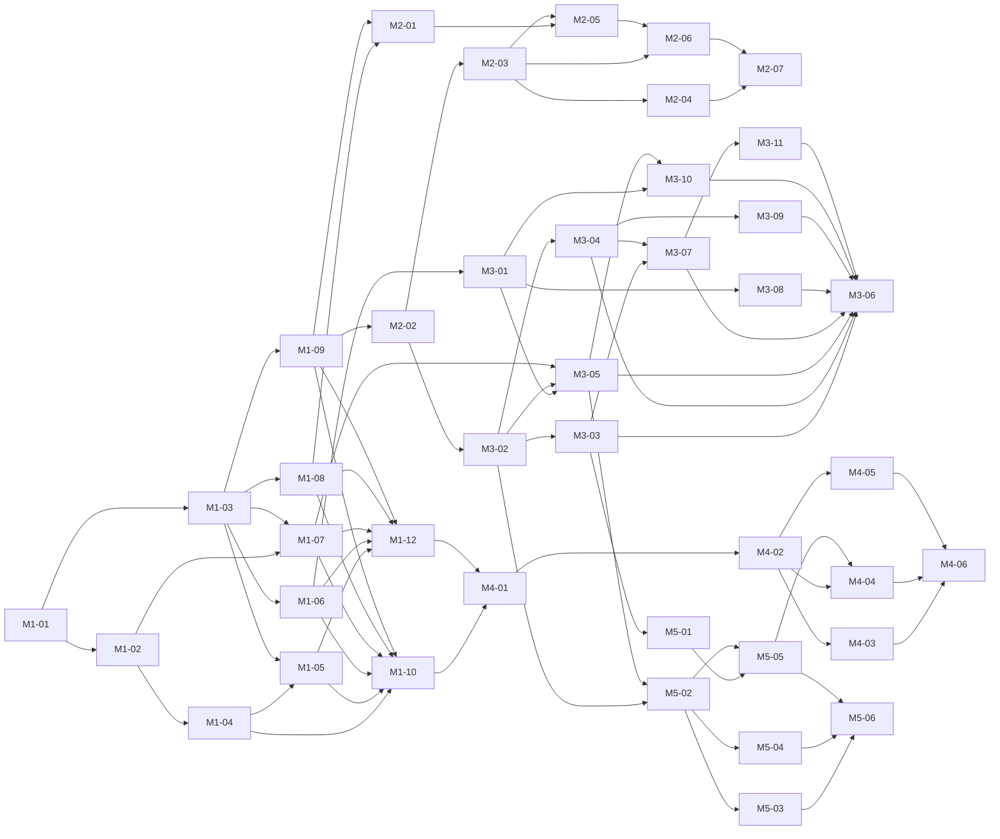

# Roadmap

App Portal is becoming a self-service software portal any company can run: a Docker-hosted server, a Windows client, and a SYSTEM agent on each PC. Action1 becomes one install engine among others. This page records the decisions behind that, the milestones, and the status of every work package. Packages are specified one per file under [`docs/plans/`](plans/README.md).

## Decisions

Settled on 2026-09-19. Change them here first, then in the plans that depend on them.

| Area | Decision |
|---|---|
| Audience | A product for any company, any directory or none. The author's own Action1 tenant is the first deployment, not the design limit. |
| Identity | Devices enroll with managed enrollment keys and hold a device token. The client sends the signed-in Windows account with installs and requests; it is trusted because the PC is managed. Admins sign in with local accounts on the server; optional directory sign-in (M1-11) is an add-on, off unless configured, and local accounts are always checked first. OpenID Connect sign-in is a later add-on. No dependency on Active Directory. |
| Storage | SQLite on the existing data volume is the source of truth for catalog, devices, installs, requests, admins and enrollment keys. `deploy/config/catalog.json` seeds an empty database; `catalog import` and `catalog export` remain. |
| Install engines | Two: **action1** (exists) and **agent**, a Windows service running as SYSTEM. A device may have both. A server-wide preference picks the engine when both apply; each catalog app can override it. Every install is labelled with the engine that ran it. Games are ordinary catalog apps; the agent must show download progress and resume downloads. |
| Package sources | What the agent can install from, settled 2026-09-22 for milestone 5. A winget package, a Microsoft Store package (winget's `msstore` source, not a second mechanism), a direct installer with silent arguments and a SHA-256, or a package the PC's own package manager knows: Scoop, Chocolatey, npm, Bun, pip, Cargo, vcpkg, .NET tools, PowerShell modules, Yarn. The managers are one package kind driven by one table of manager descriptions, not one executor each. A manager the PC lacks is a readable failure and a prerequisite an administrator can declare, never something the portal installs behind their back. |
| Agent | Installed on every device. Takes over self-update of client and agent by running the newer MSI. The scheduled-task updater and the rename swap retire with it. |
| Install shapes | A Windows install is not one shape. A catalog app says who runs it (`scope`: SYSTEM or the signed-in person), whether a restart finishes it (`requiresReboot`), and which catalog apps come first (`requires`). The agent honours all three. |
| Requirements | An app may also state what it needs in plain words, such as Secure Boot or a vendor account. The portal shows that text and asks the person to confirm it. It does not read TPM or Secure Boot state and never refuses an install on those grounds: installing is not running, the vendor owns the rules, and the person at the PC is better placed to judge. |
| Launcher content | The portal installs launchers and applications. Content a launcher downloads for one signed-in account is outside it: the portal has no account there and no licence to drive one. This is a boundary in the README, not a gap to close later. |
| Requests | Free-text box in the client. Admins approve or deny with an optional reason. The requester sees status and reason in the client. No email. No link from a request to a catalog app. |
| Admin surfaces | Razor Pages + htmx web UI on the server, and full admin parity inside the Windows client: install history, catalog, requests, devices, enrollment keys, admin accounts. |
| Installer | A WiX MSI with `SERVERURL` and `ENROLLMENTKEY` properties for Group Policy, Intune and RMM silent installs, plus an Avalonia `Setup.exe` that collects the two values and runs the MSI. One build produces both. |
| Releases | Every milestone ships through the release gate in `.github/workflows/ci.yml`. The full gate, Windows jobs included, is run on `main` and green before the tag; the tag is what reaches devices and cannot be recalled. |

## Milestones

| Milestone | Version | Delivers |
|---|---|---|
| 1 | 0.3.0 | SQLite, requester identity, app requests, web admin UI with local accounts, catalog CRUD, install history, devices, enrollment key management |
| 2 | 0.6.0 | Enrollment API, agent service taking over updates, MSI and Setup.exe, installer verification in CI |
| 3 | 0.5.0 | Agent install engine: every shape a Windows install takes. winget and direct installers, job protocol with progress, engine preference and labels, per-user installs, device requirements, restarts, prerequisite chains, uninstall |
| 5 | 0.7.0 | Every way software arrives: Microsoft Store apps, ten more package managers behind one package kind, which managers each PC has, managed packages in the installed list, and one way to add an app |
| 4 | 0.8.0 | Full admin parity in the Windows client over an admin JSON API |

Milestone 2 was meant to be 0.4.0. Milestone 3 finished first and shipped as 0.5.0, so 0.4.0 was never cut and milestone 2's remainder ships as 0.6.0 instead. Versions only go forwards, so the number a milestone carries is a label rather than a promise.

Milestone 5 goes before milestone 4 for one reason. M4-04 builds a catalog editor inside the Windows client, and M4-01's `AdminCatalogApp` carries the whole definition. Milestone 5 changes what a definition can hold. Building the client editor first means building it twice. M4-01 is already Done and stays Done; additive contract changes are ordinary.

## Packages and status

Status values: **Open**, **In progress**, **In review**, **Done**. A package may start only when every package in its *Depends on* column is Done. Packages that share no unfinished dependency can run in parallel.

| Package | Title | Depends on | Status |
|---|---|---|---|
| [M1-01](plans/M1-01-sqlite-storage.md) | SQLite storage layer | none | Done |
| [M1-02](plans/M1-02-requester-identity.md) | Requester identity on installs | M1-01 | Done |
| [M1-03](plans/M1-03-admin-accounts-and-web-shell.md) | Admin accounts and web shell | M1-01 | Done |
| [M1-04](plans/M1-04-app-requests.md) | App requests: API and client | M1-02 | Done |
| [M1-05](plans/M1-05-requests-admin-pages.md) | Requests admin pages | M1-03, M1-04 | Done |
| [M1-06](plans/M1-06-catalog-admin-pages.md) | Catalog management pages | M1-03 | Done |
| [M1-07](plans/M1-07-install-history-pages.md) | Install history pages | M1-02, M1-03 | Done |
| [M1-08](plans/M1-08-enrollment-key-pages.md) | Enrollment key management | M1-03 | Done |
| [M1-09](plans/M1-09-device-admin-pages.md) | Device management pages | M1-03 | Done |
| [M1-10](plans/M1-10-release-0.3.0.md) | Release 0.3.0 | M1-04, M1-05, M1-06, M1-07, M1-08, M1-09 | Done |
| [M1-11](plans/M1-11-directory-sign-in.md) | Optional directory sign-in for administrators | M1-03 | Done |
| [M1-12](plans/M1-12-admin-list-module.md) | Administration list queries in one module | M1-05, M1-06, M1-07, M1-08, M1-09 | Done |
| [M2-01](plans/M2-01-enrollment-api.md) | Enrollment API | M1-08, M1-09 | Done |
| [M2-02](plans/M2-02-agent-service.md) | Agent service skeleton and heartbeat | M1-09 | Done |
| [M2-03](plans/M2-03-msi-packaging.md) | MSI packaging of client and agent | M2-02 | Done |
| [M2-04](plans/M2-04-agent-self-update.md) | Agent self-update via MSI | M2-03 | Done |
| [M2-05](plans/M2-05-setup-bootstrapper.md) | Setup.exe bootstrapper | M2-01, M2-03 | Done |
| [M2-06](plans/M2-06-installer-ci-verification.md) | Installer verification in CI | M2-03, M2-05 | Done |
| [M2-07](plans/M2-07-release-0.6.0.md) | Release 0.6.0 | M2-04, M2-06 | Done |
| [M3-01](plans/M3-01-local-package-definitions.md) | Local package definitions in the catalog | M1-06 | Done |
| [M3-02](plans/M3-02-agent-job-protocol.md) | Agent job protocol with progress | M2-02 | Done |
| [M3-03](plans/M3-03-winget-executor.md) | winget executor | M3-02 | Done |
| [M3-04](plans/M3-04-direct-installer-executor.md) | Direct installer executor | M3-02 | Done |
| [M3-05](plans/M3-05-engine-selection.md) | Engine selection and labels | M3-01, M3-02, M1-07 | Done |
| [M3-06](plans/M3-06-release-0.5.0.md) | Release 0.5.0 | M3-03, M3-04, M3-05, M3-07, M3-08, M3-09, M3-10, M3-11 | Done |
| [M3-07](plans/M3-07-user-session-installs.md) | Installs that run as the signed-in person | M3-03, M3-04 | Done |
| [M3-08](plans/M3-08-app-requirements.md) | Requirements the person reads before installing | M3-01 | Done |
| [M3-09](plans/M3-09-reboot-orchestration.md) | Restarts as part of the install | M3-02, M3-04 | Done |
| [M3-10](plans/M3-10-prerequisite-chains.md) | Software that needs other software first | M3-01, M3-05 | Done |
| [M3-11](plans/M3-11-uninstall.md) | Taking software off again | M3-03, M3-04, M3-07 | Done |
| [M4-01](plans/M4-01-admin-json-api.md) | Admin JSON API and client admin sessions | M1-10, M1-12 | Done |
| [M4-02](plans/M4-02-client-admin-shell.md) | Client admin sign-in and navigation | M4-01 | In review |
| [M4-03](plans/M4-03-client-installs-and-requests.md) | Client admin: installs and requests | M4-02 | In review |
| [M4-04](plans/M4-04-client-catalog.md) | Client admin: catalog | M4-02 | In review |
| [M4-05](plans/M4-05-client-devices-keys-admins.md) | Client admin: devices, keys, admins | M4-02 | Open |
| [M4-06](plans/M4-06-release-0.8.0.md) | Release 0.8.0 | M4-03, M4-04, M4-05 | Open |
| [M5-01](plans/M5-01-microsoft-store-apps.md) | Microsoft Store apps | M3-03 | Done |
| [M5-02](plans/M5-02-package-managers.md) | Package managers as one kind | M3-02, M3-05 | Done |
| [M5-03](plans/M5-03-managers-on-a-device.md) | Which package managers a device has | M5-02 | Done |
| [M5-04](plans/M5-04-managed-packages-in-the-installed-list.md) | Managed packages in the installed list | M5-02 | Done |
| [M5-05](plans/M5-05-one-way-to-add-an-app.md) | One way to add an app | M5-01, M5-02 | In review |
| [M5-06](plans/M5-06-release-0.7.0.md) | Release 0.7.0 | M5-03, M5-04, M5-05 | Open |

Milestone 3 shipped as [v0.5.0](https://github.com/Duresa7/app-portal/releases/tag/v0.5.0). The full gate, Windows jobs included, was run on the release commit before the tag and passed. **None of the VM verification in the milestone 3 plans was done.** The Win32 code behind per-user installs has only ever run against a test double, and no installer has been run by the agent outside a fake process runner, so prove a per-user install and a restart on one real PC before trusting this to a fleet.

Milestone 2 finished after milestone 3 and shipped as [v0.6.0](https://github.com/Duresa7/app-portal/releases/tag/v0.6.0). The full gate passed on the release commit and again on the tag, and `installer-verify` ran for the first time on both: the bootstrapper installed silently, the PC enrolled itself, an administrator saw it with a heartbeat, the installed client rendered, the uninstall left nothing, and an upgrade over 0.5.0 kept the device token and left one installed copy. The downloaded MSI matches its published `SHA256SUMS` line and `ghcr.io/duresa7/app-portal-server:0.6.0` pulls without credentials. The agent now keeps the whole installation current from the release MSI, `AppPortalSetup.exe` puts one PC on through a wizard or one silent command, and the client zip retires.

The caveat from 0.5.0 still stands for the install engine: **the Win32 code behind per-user installs has still never run outside a test double.** What is no longer untested is the package itself. `deploy/windows/ci-installer-test.ps1` installs it on a Windows runner, enrolls it against a real server, uses it and takes it off again, and the release cannot be built if any of that fails.

An audit before the tag found six defects in the milestone 3 work, all fixed in [#42](https://github.com/Duresa7/app-portal/pull/42): a catalog column the admin form silently dropped, a prerequisite chain that stopped dead when one of its steps ran through Action1, a mislabelled engine on a cross-engine chain, per-user installs recorded as failures after a restart, a client that could not tell a removal from an install, and the flaky shutdown test.

The sweep M3-09 specifies, which the agent had never actually done, now runs at every service start. That covers a restart and an upgrade, because both end in one. It does not cover a person's own profile: that sweep has to run inside their session and they may not have signed in, so a per-user list stays as fresh as that person's last install. `RestartConfirmation` says which of the two lists it is reading and why.

Milestone 1 shipped as [v0.3.0](https://github.com/Duresa7/app-portal/releases/tag/v0.3.0). The [release gate](https://github.com/Duresa7/app-portal/actions/runs/35485822532) passed, the downloaded client archive matched `SHA256SUMS`, and `ghcr.io/duresa7/app-portal-server:0.3.0` was pulled without registry credentials. The upgrade check used a copied 0.2.1 fake-mode data volume; validate a copy of production data before upgrading a live deployment.

## Dependency graph

What can start today: milestones 1, 2 and 3 are Done, and so are M4-01 and M5-01 to M5-04. M5-05 waits on nothing else. M4-02 could start at any time; M4-04 waits on M5-05 so that the client's catalog editor is built once.

## Shared interface

Names every package must use so that parallel work fits together. Details live in the plan that introduces each item.

- **Engines** are named `action1` and `agent`, lower case, everywhere: database, JSON, UI labels ("via Action1", "via Agent").
- **Token prefixes:** device tokens `apd_` (exists), admin API tokens `apa_`, enrollment keys `ape_`. Only SHA-256 hashes are stored.
- **Requester header:** the client sends `X-AppPortal-User: DOMAIN\user` on every API call. The server records it as `requested_by`.
- **Routes:** device API stays under `/api/v1/`. Web admin lives under `/admin` with cookie auth. Admin JSON API lives under `/api/v1/admin/` with bearer `apa_` tokens. Enrollment is `POST /api/v1/enroll`. Agent endpoints live under `/api/v1/agent/`.
- **Install scope** is `machine` or `user`, lower case, in definitions, JSON and the database. In the UI it reads "Installs for everyone" and "Installs for you".
- **Job states:** `queued`, `leased`, `waiting_for_user`, `downloading`, `installing`, `succeeded`, `failed`, `cancelled`.
- **Restart:** an install waiting for one carries `reboot_state` of `pending`, then `confirmed`. The UI says "Restart to finish". Never "reboot" in anything a person reads.
- **Database:** one SQLite file, `Portal:DataDirectory/app-portal.db`. Tables and columns are defined in M1-01 and extended only by the plans that say so.

## Deferred

Not planned in any milestone: installing the content a launcher manages, installing for every account on a device at once, repairing an install in place, version constraints on a prerequisite, OpenID Connect admin sign-in, group-to-role mapping for directory accounts, email notifications, linking requests to catalog apps, per-group catalogs, code signing of the MSI and executables, other RMM engines such as Intune, updater rollback on Action1-only devices.
