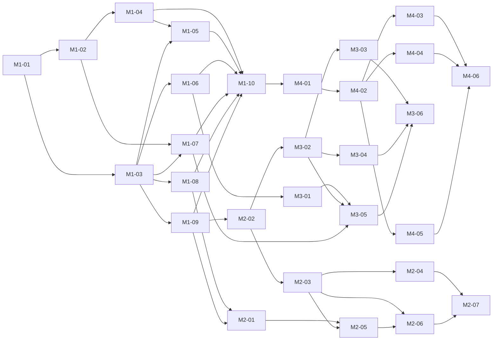

# Roadmap

App Portal is becoming a self-service software portal any company can run: a Docker-hosted server, a Windows client, and a SYSTEM agent on each PC. Action1 becomes one install engine among others. This page records the decisions behind that, the milestones, and the status of every work package. Packages are specified one per file under [`docs/plans/`](plans/README.md).

## Decisions

Settled on 2026-09-19. Change them here first, then in the plans that depend on them.

| Area | Decision |
|---|---|
| Audience | A product for any company, any directory or none. The author's own Action1 tenant is the first deployment, not the design limit. |
| Identity | Devices enroll with managed enrollment keys and hold a device token. The client sends the signed-in Windows account with installs and requests; it is trusted because the PC is managed. Admins sign in with local accounts on the server. OpenID Connect sign-in is a later add-on. No dependency on Active Directory. |
| Storage | SQLite on the existing data volume is the source of truth for catalog, devices, installs, requests, admins and enrollment keys. `deploy/config/catalog.json` seeds an empty database; `catalog import` and `catalog export` remain. |
| Install engines | Two: **action1** (exists) and **agent**, a Windows service running as SYSTEM that installs winget packages or direct installers with silent arguments and a SHA-256. A device may have both. A server-wide preference picks the engine when both apply; each catalog app can override it. Every install is labelled with the engine that ran it. Games are ordinary catalog apps; the agent must show download progress and resume downloads. |
| Agent | Installed on every device. Takes over self-update of client and agent by running the newer MSI. The scheduled-task updater and the rename swap retire with it. |
| Requests | Free-text box in the client. Admins approve or deny with an optional reason. The requester sees status and reason in the client. No email. No link from a request to a catalog app. |
| Admin surfaces | Razor Pages + htmx web UI on the server, and full admin parity inside the Windows client: install history, catalog, requests, devices, enrollment keys, admin accounts. |
| Installer | A WiX MSI with `SERVERURL` and `ENROLLMENTKEY` properties for Group Policy, Intune and RMM silent installs, plus an Avalonia `Setup.exe` that collects the two values and runs the MSI. One build produces both. |
| Releases | Every milestone ships through the release gate in `.github/workflows/ci.yml`. A human tags. |

## Milestones

| Milestone | Version | Delivers |
|---|---|---|
| 1 | 0.3.0 | SQLite, requester identity, app requests, web admin UI with local accounts, catalog CRUD, install history, devices, enrollment key management |
| 2 | 0.4.0 | Enrollment API, agent service taking over updates, MSI and Setup.exe, installer verification in CI |
| 3 | 0.5.0 | Agent install engine: winget and direct installers, job protocol with progress, engine preference and labels |
| 4 | 0.6.0 | Full admin parity in the Windows client over an admin JSON API |

## Packages and status

Status values: **Open**, **In progress**, **In review**, **Done**. A package may start only when every package in its *Depends on* column is Done. Packages that share no unfinished dependency can run in parallel.

| Package | Title | Depends on | Status |
|---|---|---|---|
| [M1-01](plans/M1-01-sqlite-storage.md) | SQLite storage layer | none | Done |
| [M1-02](plans/M1-02-requester-identity.md) | Requester identity on installs | M1-01 | Done |
| [M1-03](plans/M1-03-admin-accounts-and-web-shell.md) | Admin accounts and web shell | M1-01 | Done |
| [M1-04](plans/M1-04-app-requests.md) | App requests: API and client | M1-02 | Done |
| [M1-05](plans/M1-05-requests-admin-pages.md) | Requests admin pages | M1-03, M1-04 | Open |
| [M1-06](plans/M1-06-catalog-admin-pages.md) | Catalog management pages | M1-03 | Done |
| [M1-07](plans/M1-07-install-history-pages.md) | Install history pages | M1-02, M1-03 | In review |
| [M1-08](plans/M1-08-enrollment-key-pages.md) | Enrollment key management | M1-03 | Open |
| [M1-09](plans/M1-09-device-admin-pages.md) | Device management pages | M1-03 | In review |
| [M1-10](plans/M1-10-release-0.3.0.md) | Release 0.3.0 | M1-04, M1-05, M1-06, M1-07, M1-08, M1-09 | Open |
| [M2-01](plans/M2-01-enrollment-api.md) | Enrollment API | M1-08, M1-09 | Open |
| [M2-02](plans/M2-02-agent-service.md) | Agent service skeleton and heartbeat | M1-09 | Open |
| [M2-03](plans/M2-03-msi-packaging.md) | MSI packaging of client and agent | M2-02 | Open |
| [M2-04](plans/M2-04-agent-self-update.md) | Agent self-update via MSI | M2-03 | Open |
| [M2-05](plans/M2-05-setup-bootstrapper.md) | Setup.exe bootstrapper | M2-01, M2-03 | Open |
| [M2-06](plans/M2-06-installer-ci-verification.md) | Installer verification in CI | M2-03, M2-05 | Open |
| [M2-07](plans/M2-07-release-0.4.0.md) | Release 0.4.0 | M2-04, M2-06 | Open |
| [M3-01](plans/M3-01-local-package-definitions.md) | Local package definitions in the catalog | M1-06 | Open |
| [M3-02](plans/M3-02-agent-job-protocol.md) | Agent job protocol with progress | M2-02 | Open |
| [M3-03](plans/M3-03-winget-executor.md) | winget executor | M3-02 | Open |
| [M3-04](plans/M3-04-direct-installer-executor.md) | Direct installer executor | M3-02 | Open |
| [M3-05](plans/M3-05-engine-selection.md) | Engine selection and labels | M3-01, M3-02, M1-07 | Open |
| [M3-06](plans/M3-06-release-0.5.0.md) | Release 0.5.0 | M3-03, M3-04, M3-05 | Open |
| [M4-01](plans/M4-01-admin-json-api.md) | Admin JSON API and client admin sessions | M1-10 | Open |
| [M4-02](plans/M4-02-client-admin-shell.md) | Client admin sign-in and navigation | M4-01 | Open |
| [M4-03](plans/M4-03-client-installs-and-requests.md) | Client admin: installs and requests | M4-02 | Open |
| [M4-04](plans/M4-04-client-catalog.md) | Client admin: catalog | M4-02 | Open |
| [M4-05](plans/M4-05-client-devices-keys-admins.md) | Client admin: devices, keys, admins | M4-02 | Open |
| [M4-06](plans/M4-06-release-0.6.0.md) | Release 0.6.0 | M4-03, M4-04, M4-05 | Open |

## Dependency graph

What can start today: M1-01 alone. Once it is Done: M1-02 and M1-03 in parallel. Once M1-03 is Done: M1-06, M1-08 and M1-09 in parallel, and M1-07 as soon as M1-02 is Done too.

## Shared interface

Names every package must use so that parallel work fits together. Details live in the plan that introduces each item.

- **Engines** are named `action1` and `agent`, lower case, everywhere: database, JSON, UI labels ("via Action1", "via Agent").
- **Token prefixes:** device tokens `apd_` (exists), admin API tokens `apa_`, enrollment keys `ape_`. Only SHA-256 hashes are stored.
- **Requester header:** the client sends `X-AppPortal-User: DOMAIN\user` on every API call. The server records it as `requested_by`.
- **Routes:** device API stays under `/api/v1/`. Web admin lives under `/admin` with cookie auth. Admin JSON API lives under `/api/v1/admin/` with bearer `apa_` tokens. Enrollment is `POST /api/v1/enroll`. Agent endpoints live under `/api/v1/agent/`.
- **Database:** one SQLite file, `Portal:DataDirectory/app-portal.db`. Tables and columns are defined in M1-01 and extended only by the plans that say so.

## Deferred

Not planned in any milestone: OpenID Connect admin sign-in, email notifications, linking requests to catalog apps, per-group catalogs, code signing of the MSI and executables, other RMM engines such as Intune, updater rollback on Action1-only devices.
