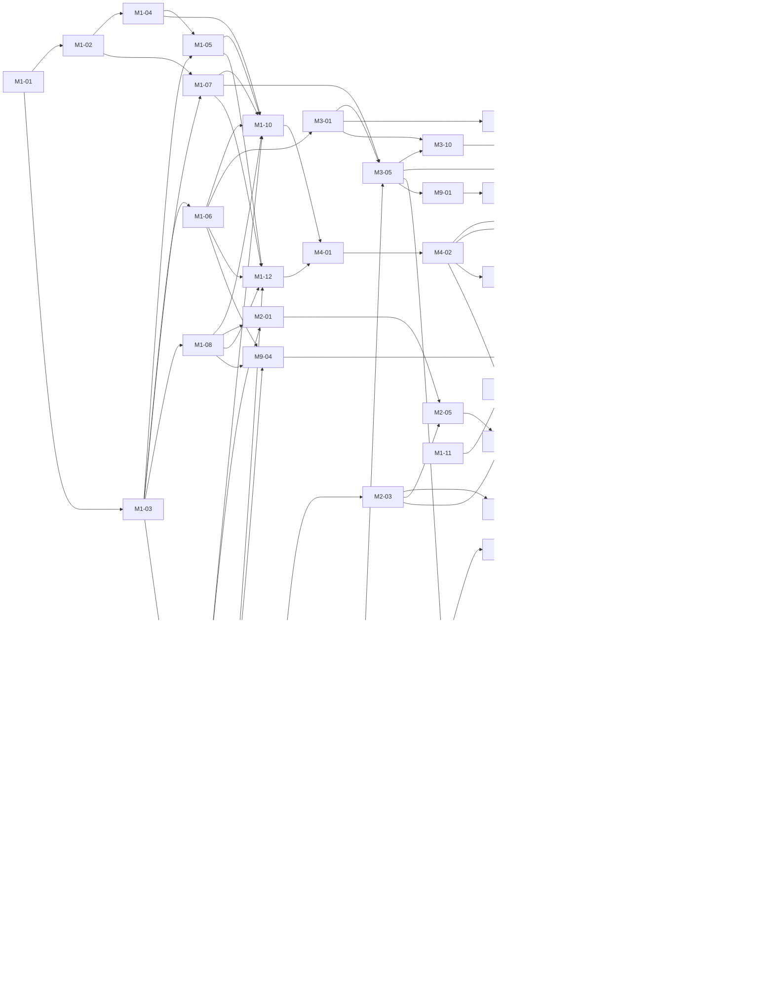

# Roadmap

App Portal is becoming a self-service software portal any company can run: a Docker-hosted server, a Windows client, and a SYSTEM agent on each PC. Action1 becomes one install engine among others. This page records the decisions behind that, the milestones, and the status of every work package. Packages are specified one per file under [`docs/plans/`](plans/README.md).

## Decisions

Settled on 2026-09-19. Change them here first, then in the plans that depend on them.

| Area | Decision |
|---|---|
| Audience | A product for any company, any directory or none. The author's own Action1 tenant is the first deployment, not the design limit. |
| Identity | Devices enroll with managed enrollment keys and hold a device token. The client sends the signed-in Windows account with installs and requests; it is trusted because the PC is managed. Admins sign in with local accounts on the server; optional directory sign-in (M1-11) is an add-on, off unless configured, and local accounts are always checked first. OpenID Connect sign-in is a later add-on. No dependency on Active Directory. |
| Storage | SQLite on the existing data volume is the source of truth for catalog, devices, installs, requests, admins and enrollment keys. `deploy/config/catalog.json` seeds an empty database; `catalog import` and `catalog export` remain. |
| Install engines | Three: **action1** (exists), **agent**, a Windows service running as SYSTEM, and, from M9-02, **intune**, which installs through Microsoft Intune app assignments. A device may have any of them. A server-wide preference picks the engine when more than one applies; each device and each catalog app can override it. The server treats engines as a list (M9-01), so another engine is one more registration. Every install is labelled with the engine that ran it. Games are ordinary catalog apps; the agent must show download progress and resume downloads. |
| Package sources | What the agent can install from, settled 2026-09-22 for milestone 5. A winget package, a Microsoft Store package (winget's `msstore` source, not a second mechanism), a direct installer with silent arguments and a SHA-256, or a package the PC's own package manager knows: Scoop, Chocolatey, npm, Bun, pip, Cargo, vcpkg, .NET tools, PowerShell modules, Yarn. The managers are one package kind driven by one table of manager descriptions, not one executor each. A manager the PC lacks is a readable failure and a prerequisite an administrator can declare, never something the portal installs behind their back. |
| Agent | Installed on every device. Takes over self-update of client and agent by running the newer MSI. The scheduled-task updater and the rename swap retire with it. |
| Install shapes | A Windows install is not one shape. A catalog app says who runs it (`scope`: SYSTEM or the signed-in person), whether a restart finishes it (`requiresReboot`), and which catalog apps come first (`requires`). The agent honours all three. |
| Requirements | An app may also state what it needs in plain words, such as Secure Boot or a vendor account. The portal shows that text and asks the person to confirm it. It does not read TPM or Secure Boot state and never refuses an install on those grounds: installing is not running, the vendor owns the rules, and the person at the PC is better placed to judge. |
| Launcher content | The portal installs launchers and applications. Content a launcher downloads for one signed-in account belongs to that account: the portal has no account there and no licence to drive one. Changed on 2026-09-29 at the owner's request: from M8-02 the portal may hand a game to its launcher, which opens that game's install page in the person's own session, and the person finishes there with their own account. The portal never signs in to a launcher, never drives one, and never downloads game content itself. |
| Requests | Free-text box in the client. Admins approve or deny with an optional reason. An approval may name the catalog app that answers it, either one already in the catalog or one the administrator creates from the request, and the requester's client then points them to it. The requester sees status and reason in the client. No email. Approving never installs anything. |
| Admin surfaces | Razor Pages + htmx web UI on the server, and full admin parity inside the Windows client: install history, catalog, requests, devices, enrollment keys, admin accounts. |
| Installer | A WiX MSI with `SERVERURL` and `ENROLLMENTKEY` properties for Group Policy, Intune and RMM silent installs, plus an Avalonia `Setup.exe` that collects the two values and runs the MSI. One build produces both. |
| Releases | Every milestone ships through the release gate in `.github/workflows/ci.yml`. The full gate, Windows jobs included, is run on `main` and green before the tag; the tag is what reaches devices and cannot be recalled. |

## Milestones

| Milestone | Version | Delivers |
|---|---|---|
| 1 | 0.3.0 | SQLite, requester identity, app requests, web admin UI with local accounts, catalog CRUD, install history, devices, enrollment key management |
| 2 | 0.6.0 | Enrollment API, agent service taking over updates, MSI and Setup.exe, installer verification in CI |
| 3 | 0.5.0 | Agent install engine: every shape a Windows install takes. winget and direct installers, job protocol with progress, engine preference and labels, per-user installs, device requirements, restarts, prerequisite chains, uninstall |
| 5 | 0.7.0 | Every way software arrives: Microsoft Store apps, ten more package managers behind one package kind, which managers each PC has, managed packages in the installed list, and one way to add an app |
| 4 | 0.8.0 | Full admin parity in the Windows client over an admin JSON API |
| 6 | 0.9.0 | Per-user and restart installs proven on a real PC, approved requests that point to an app, and releases that can be signed |
| 7 | 0.10.0 | The client's admin flows proven on a PC, and a per-user installed list swept each time the person signs in |
| 8 | 0.11.0 | Every kind of software, games included: portable apps, games handed to their launcher, anti-cheat on the device page, catalog packs, updates, repair and private winget sources |
| 9 | 0.12.0 | Intune as a third engine, sign-in with Entra ID or any OpenID Connect provider, and device groups with per-group catalogs |

Milestone 2 was meant to be 0.4.0. Milestone 3 finished first and shipped as 0.5.0, so 0.4.0 was never cut and milestone 2's remainder ships as 0.6.0 instead. Versions only go forwards, so the number a milestone carries is a label rather than a promise.

Milestone 5 goes before milestone 4 for one reason. M4-04 builds a catalog editor inside the Windows client, and M4-01's `AdminCatalogApp` carries the whole definition. Milestone 5 changes what a definition can hold. Building the client editor first means building it twice. M4-01 is already Done and stays Done; additive contract changes are ordinary.

## Packages and status

Status values: **Open**, **In progress**, **In review**, **Done**. A package may start only when every package in its *Depends on* column is Done. Packages that share no unfinished dependency can run in parallel.

| Package | Title | Depends on | Status |
|---|---|---|---|
| [M1-01](plans/M1-01-sqlite-storage.md) | SQLite storage layer | none | Done |
| [M1-02](plans/M1-02-requester-identity.md) | Requester identity on installs | M1-01 | Done |
| [M1-03](plans/M1-03-admin-accounts-and-web-shell.md) | Admin accounts and web shell | M1-01 | Done |
| [M1-04](plans/M1-04-app-requests.md) | App requests: API and client | M1-02 | Done |
| [M1-05](plans/M1-05-requests-admin-pages.md) | Requests admin pages | M1-03, M1-04 | Done |
| [M1-06](plans/M1-06-catalog-admin-pages.md) | Catalog management pages | M1-03 | Done |
| [M1-07](plans/M1-07-install-history-pages.md) | Install history pages | M1-02, M1-03 | Done |
| [M1-08](plans/M1-08-enrollment-key-pages.md) | Enrollment key management | M1-03 | Done |
| [M1-09](plans/M1-09-device-admin-pages.md) | Device management pages | M1-03 | Done |
| [M1-10](plans/M1-10-release-0.3.0.md) | Release 0.3.0 | M1-04, M1-05, M1-06, M1-07, M1-08, M1-09 | Done |
| [M1-11](plans/M1-11-directory-sign-in.md) | Optional directory sign-in for administrators | M1-03 | Done |
| [M1-12](plans/M1-12-admin-list-module.md) | Administration list queries in one module | M1-05, M1-06, M1-07, M1-08, M1-09 | Done |
| [M2-01](plans/M2-01-enrollment-api.md) | Enrollment API | M1-08, M1-09 | Done |
| [M2-02](plans/M2-02-agent-service.md) | Agent service skeleton and heartbeat | M1-09 | Done |
| [M2-03](plans/M2-03-msi-packaging.md) | MSI packaging of client and agent | M2-02 | Done |
| [M2-04](plans/M2-04-agent-self-update.md) | Agent self-update via MSI | M2-03 | Done |
| [M2-05](plans/M2-05-setup-bootstrapper.md) | Setup.exe bootstrapper | M2-01, M2-03 | Done |
| [M2-06](plans/M2-06-installer-ci-verification.md) | Installer verification in CI | M2-03, M2-05 | Done |
| [M2-07](plans/M2-07-release-0.6.0.md) | Release 0.6.0 | M2-04, M2-06 | Done |
| [M3-01](plans/M3-01-local-package-definitions.md) | Local package definitions in the catalog | M1-06 | Done |
| [M3-02](plans/M3-02-agent-job-protocol.md) | Agent job protocol with progress | M2-02 | Done |
| [M3-03](plans/M3-03-winget-executor.md) | winget executor | M3-02 | Done |
| [M3-04](plans/M3-04-direct-installer-executor.md) | Direct installer executor | M3-02 | Done |
| [M3-05](plans/M3-05-engine-selection.md) | Engine selection and labels | M3-01, M3-02, M1-07 | Done |
| [M3-06](plans/M3-06-release-0.5.0.md) | Release 0.5.0 | M3-03, M3-04, M3-05, M3-07, M3-08, M3-09, M3-10, M3-11 | Done |
| [M3-07](plans/M3-07-user-session-installs.md) | Installs that run as the signed-in person | M3-03, M3-04 | Done |
| [M3-08](plans/M3-08-app-requirements.md) | Requirements the person reads before installing | M3-01 | Done |
| [M3-09](plans/M3-09-reboot-orchestration.md) | Restarts as part of the install | M3-02, M3-04 | Done |
| [M3-10](plans/M3-10-prerequisite-chains.md) | Software that needs other software first | M3-01, M3-05 | Done |
| [M3-11](plans/M3-11-uninstall.md) | Taking software off again | M3-03, M3-04, M3-07 | Done |
| [M4-01](plans/M4-01-admin-json-api.md) | Admin JSON API and client admin sessions | M1-10, M1-12 | Done |
| [M4-02](plans/M4-02-client-admin-shell.md) | Client admin sign-in and navigation | M4-01 | Done |
| [M4-03](plans/M4-03-client-installs-and-requests.md) | Client admin: installs and requests | M4-02 | Done |
| [M4-04](plans/M4-04-client-catalog.md) | Client admin: catalog | M4-02 | Done |
| [M4-05](plans/M4-05-client-devices-keys-admins.md) | Client admin: devices, keys, admins | M4-02 | Done |
| [M4-06](plans/M4-06-release-0.8.0.md) | Release 0.8.0 | M4-03, M4-04, M4-05 | Done |
| [M5-01](plans/M5-01-microsoft-store-apps.md) | Microsoft Store apps | M3-03 | Done |
| [M5-02](plans/M5-02-package-managers.md) | Package managers as one kind | M3-02, M3-05 | Done |
| [M5-03](plans/M5-03-managers-on-a-device.md) | Which package managers a device has | M5-02 | Done |
| [M5-04](plans/M5-04-managed-packages-in-the-installed-list.md) | Managed packages in the installed list | M5-02 | Done |
| [M5-05](plans/M5-05-one-way-to-add-an-app.md) | One way to add an app | M5-01, M5-02 | Done |
| [M5-06](plans/M5-06-release-0.7.0.md) | Release 0.7.0 | M5-03, M5-04, M5-05 | Done |
| [M6-01](plans/M6-01-proof-on-a-real-pc.md) | Proof on a real PC | M2-06, M3-07, M3-09, M3-11 | Done |
| [M6-02](plans/M6-02-request-to-app.md) | From a request to an app | None | Done |
| [M6-03](plans/M6-03-signed-releases.md) | Signed releases | M2-04, M2-06 | Done |
| [M6-04](plans/M6-04-release-0.9.0.md) | Release 0.9.0 | M6-01, M6-02, M6-03 | Done |
| [M7-01](plans/M7-01-client-admin-on-a-pc.md) | The client's admin flows, clicked through on a PC | M4-05 | Done |
| [M7-02](plans/M7-02-per-user-sweep-at-sign-in.md) | A fresh per-user list when a person signs in | M3-07, M5-04 | Done |
| [M7-03](plans/M7-03-release-0.10.0.md) | Release 0.10.0 | M7-01, M7-02 | Done |
| [M8-01](plans/M8-01-portable-apps.md) | Portable apps | M5-05 | Open |
| [M8-02](plans/M8-02-game-launcher-handoff.md) | Games handed to their launcher | M3-07, M5-05 | Open |
| [M8-03](plans/M8-03-anti-cheat-on-the-device.md) | Anti-cheat on the device | M2-02 | Open |
| [M8-04](plans/M8-04-catalog-packs.md) | Catalog packs | M8-01, M8-02, M8-03 | Open |
| [M8-05](plans/M8-05-updates.md) | Updates | M3-03, M5-01, M7-02 | Open |
| [M8-06](plans/M8-06-repair.md) | Repair | M8-01, M8-02, M8-05 | Open |
| [M8-07](plans/M8-07-private-winget-sources.md) | Private winget sources | M3-03 | Open |
| [M8-08](plans/M8-08-release-0.11.0.md) | Release 0.11.0 | M8-01, M8-02, M8-03, M8-04, M8-05, M8-06, M8-07 | Open |
| [M9-01](plans/M9-01-engines-as-a-list.md) | Engines as a list | M3-05 | Open |
| [M9-02](plans/M9-02-intune-engine.md) | Intune engine | M9-01 | Open |
| [M9-03](plans/M9-03-openid-connect-sign-in.md) | Sign in with Entra ID or OpenID Connect | M1-11, M4-02 | Open |
| [M9-04](plans/M9-04-device-groups.md) | Device groups and per-group catalogs | M1-06, M1-08, M1-09 | Open |
| [M9-05](plans/M9-05-release-0.12.0.md) | Release 0.12.0 | M9-01, M9-02, M9-03, M9-04 | Open |

Milestone 7 shipped as [v0.10.0](https://github.com/Duresa7/app-portal/releases/tag/v0.10.0). The agent now reports what a person's own profile carries about a minute after each time they sign in, not only after an install for them, so a per-user Installed list is as fresh as that person's last sign-in (M7-02). The two client admin flows that 0.8.0 had proven only at the API ran in the real client window on Windows 11 Pro: a key made in the client enrolled a PC, and a session the server ended signed the client out (M7-01). The release is not signed: the owner took code signing out of this milestone, and the switch from M6-03 stays off. The full gate, Windows jobs included, passed on the release commit (run 36504930972) and again on the tag (run 36505748470); the downloaded MSI and `AppPortalSetup.exe` match their `SHA256SUMS` lines, and `ghcr.io/duresa7/app-portal-server:0.10.0` is readable without credentials. Check the MSI and `AppPortalSetup.exe` against `SHA256SUMS`.

Milestone 6 shipped as [v0.9.0](https://github.com/Duresa7/app-portal/releases/tag/v0.9.0). The per-user install and the install that finishes at a restart have now run on a real PC. `deploy/windows/Test-RealPc.ps1` ran on Windows 11 Pro as a standard account, against the MSI the full gate built from the release commit, and passed all eight checks: a per-user install into the account's own profile, reported and then removed as that account; two installs held for a restart and confirmed after it; and an install parked until the account signed in. The proof found four defects, all fixed before the tag: winget did not start as SYSTEM ([#88](https://github.com/Duresa7/app-portal/pull/88)) or in a person's session ([#91](https://github.com/Duresa7/app-portal/pull/91)), the client's Restart button did nothing while another person was signed in ([#89](https://github.com/Duresa7/app-portal/pull/89)), and the proof itself needs a test account that Windows does not sign straight back in after the restart ([#92](https://github.com/Duresa7/app-portal/pull/92), [#93](https://github.com/Duresa7/app-portal/pull/93)). The full gate, Windows jobs included, passed on the release commit and again on the tag; the downloaded MSI and `AppPortalSetup.exe` match their `SHA256SUMS` lines and `ghcr.io/duresa7/app-portal-server:0.9.0` is readable without credentials. An approved request can now point to the catalog app it became. The release is not signed: the SignPath Foundation application is not approved yet, so the signing switch from M6-03 stays off and the first signed release is a later one. Check the MSI and `AppPortalSetup.exe` against `SHA256SUMS`.

Milestone 4 shipped as [v0.8.0](https://github.com/Duresa7/app-portal/releases/tag/v0.8.0): the Windows client gains an Admin area that does everything the web admin does, over the admin JSON API. Every one of the client's admin calls was run against a real server before the release, and the release gate now draws the installed client's admin dashboard as well as its Apps page. The full gate, Windows jobs included, passed on the release commit and again on the tag, after four API fixes found in review (#71 to #74) had merged; the downloaded MSI and `AppPortalSetup.exe` match their `SHA256SUMS` lines and `ghcr.io/duresa7/app-portal-server:0.8.0` is readable without credentials. The client's pages themselves have been exercised in demo mode and against test doubles; a session revoked on the web signing the client out, and a key made in the client enrolling a PC, have been proven at the API but not yet clicked through on a PC. **Closed by M7-01, for 0.10.0:** on Windows 11 Pro 25H2, with the client, the agent and a fake-mode server run from the Release build of `main`, a key made in the client and copied with its Copy button enrolled the PC through the agent, and the client's Devices page listed it with that key. Then the server ended every session of the client's account with `admin disable`, which calls the same two functions as the web page's Disable button, and the client's next admin call signed it out with the session-ended sentence and deleted its stored session. The client was driven through Windows UI Automation. The web page's button was not pressed; server tests cover it.

Milestone 5 shipped as [v0.7.0](https://github.com/Duresa7/app-portal/releases/tag/v0.7.0). The full gate, Windows jobs included, passed on the release commit and again on the tag; the downloaded MSI and `AppPortalSetup.exe` match their `SHA256SUMS` lines and `ghcr.io/duresa7/app-portal-server:0.7.0` is readable without credentials. From this release the release gate also has the agent install a real package on a real PC: `ci-installer-test.ps1` asks for a PowerShell module through Windows PowerShell, the agent installs it as SYSTEM, the server lists it under Installed as the catalog app, and the removal takes it off again. So the claim below that no installer has run outside a fake process runner no longer holds for machine-wide installs. A per-user install, which is the Win32 session code, and an install that finishes at a restart were still unproven on a real PC. **Closed by 0.9.0:** both ran on one real PC before that tag.

Milestone 3 shipped as [v0.5.0](https://github.com/Duresa7/app-portal/releases/tag/v0.5.0). The full gate, Windows jobs included, was run on the release commit before the tag and passed. **None of the VM verification in the milestone 3 plans was done.** The Win32 code behind per-user installs has only ever run against a test double, and no installer has been run by the agent outside a fake process runner, so prove a per-user install and a restart on one real PC before trusting this to a fleet. **Closed by 0.9.0:** both ran on one real PC before that tag.

Milestone 2 finished after milestone 3 and shipped as [v0.6.0](https://github.com/Duresa7/app-portal/releases/tag/v0.6.0). The full gate passed on the release commit and again on the tag, and `installer-verify` ran for the first time on both: the bootstrapper installed silently, the PC enrolled itself, an administrator saw it with a heartbeat, the installed client rendered, the uninstall left nothing, and an upgrade over 0.5.0 kept the device token and left one installed copy. The downloaded MSI matches its published `SHA256SUMS` line and `ghcr.io/duresa7/app-portal-server:0.6.0` pulls without credentials. The agent now keeps the whole installation current from the release MSI, `AppPortalSetup.exe` puts one PC on through a wizard or one silent command, and the client zip retires.

The caveat from 0.5.0 stood for the install engine: the Win32 code behind per-user installs had still never run outside a test double. **Closed by 0.9.0.** What is no longer untested is the package itself. `deploy/windows/ci-installer-test.ps1` installs it on a Windows runner, enrolls it against a real server, uses it and takes it off again, and the release cannot be built if any of that fails.

An audit before the tag found six defects in the milestone 3 work, all fixed in [#42](https://github.com/Duresa7/app-portal/pull/42): a catalog column the admin form silently dropped, a prerequisite chain that stopped dead when one of its steps ran through Action1, a mislabelled engine on a cross-engine chain, per-user installs recorded as failures after a restart, a client that could not tell a removal from an install, and the flaky shutdown test.

The sweep M3-09 specifies, which the agent had never actually done, now runs at every service start. That covers a restart and an upgrade, because both end in one. It does not cover a person's own profile: that sweep has to run inside their session and they may not have signed in, so a per-user list stays as fresh as that person's last install. `RestartConfirmation` says which of the two lists it is reading and why. **From 0.10.0** (M7-02) the agent also sweeps a person's list a minute after each sign-in, so it is as fresh as their last sign-in.

Milestone 1 shipped as [v0.3.0](https://github.com/Duresa7/app-portal/releases/tag/v0.3.0). The [release gate](https://github.com/Duresa7/app-portal/actions/runs/35485822532) passed, the downloaded client archive matched `SHA256SUMS`, and `ghcr.io/duresa7/app-portal-server:0.3.0` was pulled without registry credentials. The upgrade check used a copied 0.2.1 fake-mode data volume; validate a copy of production data before upgrading a live deployment.

## Dependency graph

```mermaid
graph LR
  M1-01 --> M1-02 --> M1-04 --> M1-05
  M1-01 --> M1-03 --> M1-05
  M1-03 --> M1-06
  M1-02 --> M1-07
  M1-03 --> M1-07
  M1-03 --> M1-08
  M1-03 --> M1-09
  M1-04 & M1-05 & M1-06 & M1-07 & M1-08 & M1-09 --> M1-10
  M1-08 & M1-09 --> M2-01
  M1-09 --> M2-02 --> M2-03 --> M2-04
  M2-01 & M2-03 --> M2-05
  M2-03 & M2-05 --> M2-06
  M2-04 & M2-06 --> M2-07
  M1-06 --> M3-01
  M2-02 --> M3-02 --> M3-03
  M3-02 --> M3-04
  M3-01 & M3-02 & M1-07 --> M3-05
  M3-03 & M3-04 --> M3-07 --> M3-11
  M3-01 --> M3-08
  M3-04 --> M3-09
  M3-01 & M3-05 --> M3-10
  M3-03 & M3-04 & M3-05 & M3-07 & M3-08 & M3-09 & M3-10 & M3-11 --> M3-06
  M1-05 & M1-06 & M1-07 & M1-08 & M1-09 --> M1-12
  M1-10 & M1-12 --> M4-01 --> M4-02 --> M4-03
  M4-02 --> M4-04
  M4-02 --> M4-05
  M4-03 & M4-04 & M4-05 --> M4-06
  M3-03 --> M5-01
  M3-02 & M3-05 --> M5-02
  M5-02 --> M5-03
  M5-02 --> M5-04
  M5-01 & M5-02 --> M5-05
  M5-03 & M5-04 & M5-05 --> M5-06
  M5-05 --> M4-04
  M2-06 & M3-07 & M3-09 & M3-11 --> M6-01
  M2-04 & M2-06 --> M6-03
  M6-01 & M6-02 & M6-03 --> M6-04
  M4-05 --> M7-01
  M3-07 & M5-04 --> M7-02
  M7-01 & M7-02 --> M7-03
  M5-05 --> M8-01
  M3-07 & M5-05 --> M8-02
  M2-02 --> M8-03
  M8-01 & M8-02 & M8-03 --> M8-04
  M3-03 & M5-01 & M7-02 --> M8-05
  M8-01 & M8-02 & M8-05 --> M8-06
  M3-03 --> M8-07
  M8-04 & M8-06 & M8-07 --> M8-08
  M3-05 --> M9-01 --> M9-02
  M1-11 & M4-02 --> M9-03
  M1-06 & M1-08 & M1-09 --> M9-04
  M9-02 & M9-03 & M9-04 --> M9-05
```

What can start today: milestones 1 to 7 have shipped. Milestone 8 is next: M8-01, M8-02, M8-03, M8-05 and M8-07 have no unfinished dependency. Milestone 9's M9-01, M9-03 and M9-04 have none either; the owner asked for milestone 8 first.

## Shared interface

Names every package must use so that parallel work fits together. Details live in the plan that introduces each item.

- **Engines** are named `action1` and `agent`, lower case, everywhere: database, JSON, UI labels ("via Action1", "via Agent").
- **Token prefixes:** device tokens `apd_` (exists), admin API tokens `apa_`, enrollment keys `ape_`. Only SHA-256 hashes are stored.
- **Requester header:** the client sends `X-AppPortal-User: DOMAIN\user` on every API call. The server records it as `requested_by`.
- **Routes:** device API stays under `/api/v1/`. Web admin lives under `/admin` with cookie auth. Admin JSON API lives under `/api/v1/admin/` with bearer `apa_` tokens. Enrollment is `POST /api/v1/enroll`. Agent endpoints live under `/api/v1/agent/`.
- **Install scope** is `machine` or `user`, lower case, in definitions, JSON and the database. In the UI it reads "Installs for everyone" and "Installs for you".
- **Job states:** `queued`, `leased`, `waiting_for_user`, `downloading`, `installing`, `succeeded`, `failed`, `cancelled`.
- **Restart:** an install waiting for one carries `reboot_state` of `pending`, then `confirmed`. The UI says "Restart to finish". Never "reboot" in anything a person reads.
- **Database:** one SQLite file, `Portal:DataDirectory/app-portal.db`. Tables and columns are defined in M1-01 and extended only by the plans that say so.

## Next

Milestones 8 and 9 are planned above. The owner asked on 2026-09-29 for them: every kind of software, games and anti-cheat included, the Intune engine, and the deferred items that make the portal fit more companies. Email notifications stay out, at the owner's word.

## Deferred

Reviewed for milestones 8 and 9: four items left this list for a milestone: repairing an install in place (M8-06), OpenID Connect admin sign-in (M9-03), per-group catalogs (M9-04) and other RMM engines, starting with Intune (M9-02). Installing the content a launcher manages stays out; handing a game to its launcher (M8-02) is the part that fits the **Launcher content** decision. Email notifications stay out at the owner's word.

Reviewed for milestone 7: the owner decided on 2026-09-28 not to take code signing further in this milestone. Two items drafted for it join the list: the first signed release, proven on a throwaway VM as M6-03 describes, and a check of the MSI's `UpgradeCode` by a signed agent, which only matters once an agent is signed. The signing switch from M6-03 stays off, and releases stay unsigned. Nothing else here became urgent.

Reviewed for 0.9.0: nothing here became urgent. Three items M6-03 left out join the list: signing `SHA256SUMS`, signing the server image, and submitting winget manifests.

Reviewed for 0.8.0: code signing and turning a request into an app became milestone 6.

Not planned in any milestone: installing the content a launcher manages, installing for every account on a device at once, version constraints on a prerequisite, group-to-role mapping for directory accounts, email notifications, RMM engines other than Intune, updater rollback on Action1-only devices, signing `SHA256SUMS`, signing the server image, submitting winget manifests, the first signed release, checking the `UpgradeCode` of an update MSI.
