# Administration

There are two places to administer the portal, and they do the same things:

- **The web admin**, at `/admin` on the server. Use it from any browser, including from a PC that has no App Portal on it.
- **The Admin area of the Windows client.** Choose **Admin** at the foot of the pane and sign in with the same administrator account. Use it on a PC that already runs the client, so you do not have to find the server's address. The client stays signed in for that Windows account until you sign out or the session is revoked; the token is encrypted for that account and is never written to `client.json`.

Both sign in with a local administrator account (or a [directory account](server-setup.md#directory-sign-in-optional)). Browser sessions use cookies and forms require antiforgery tokens. The client uses an `apa_` bearer token from the admin JSON API; device tokens cannot open either. Every action on a web admin page has a counterpart in the client.

| | |
|---|---|
| 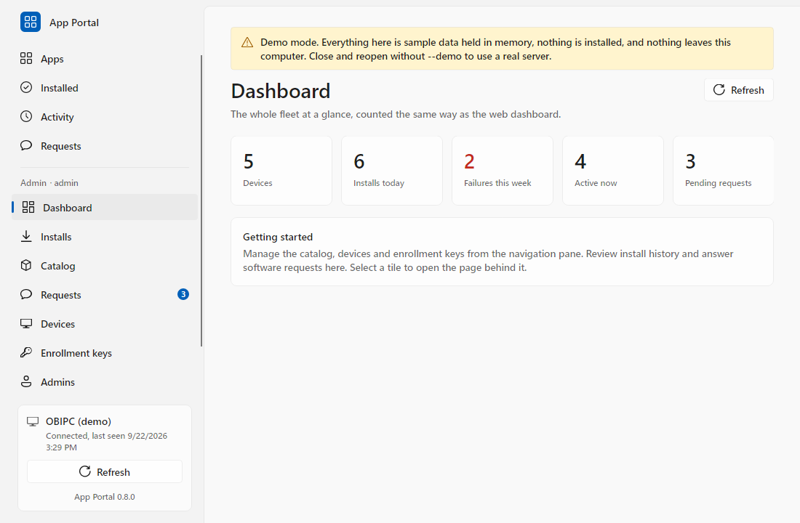 | 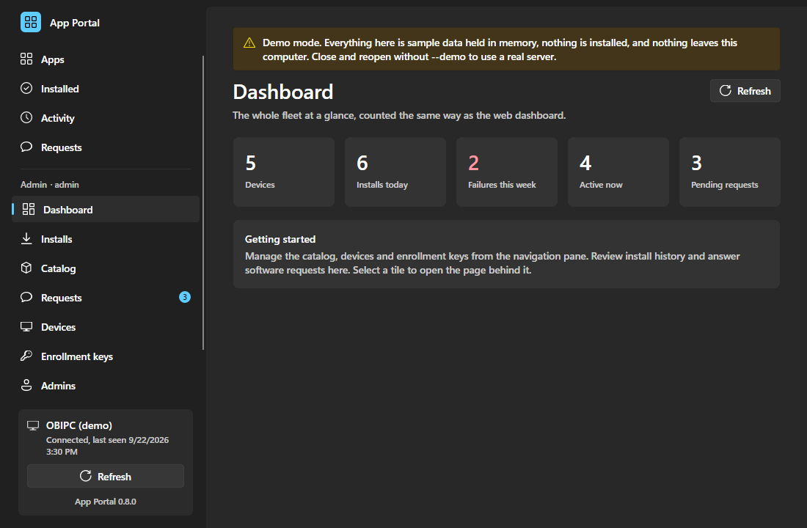 |
| 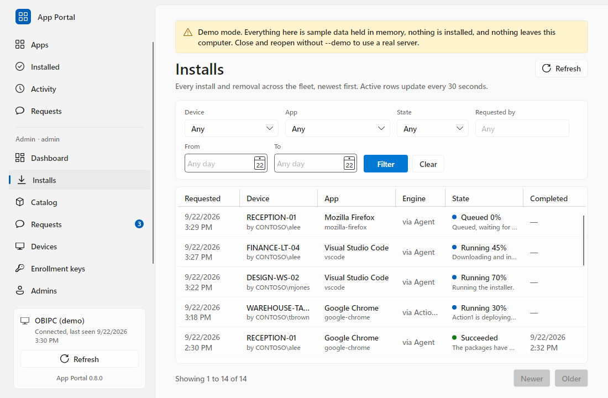 | 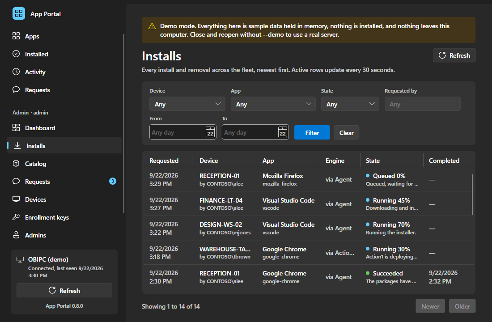 |
| 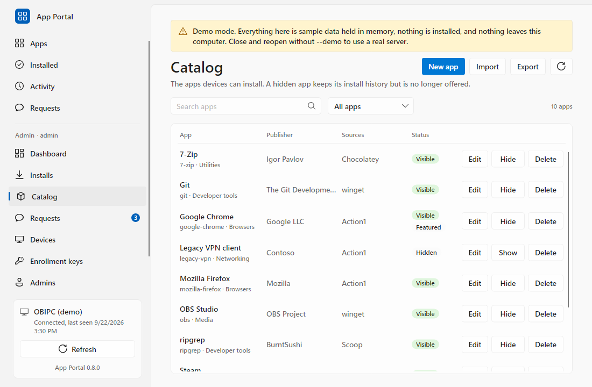 | 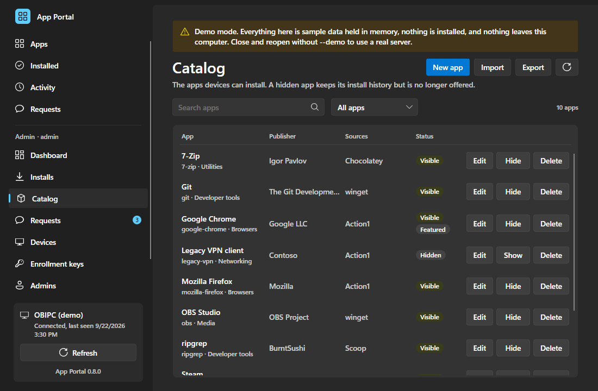 |
| 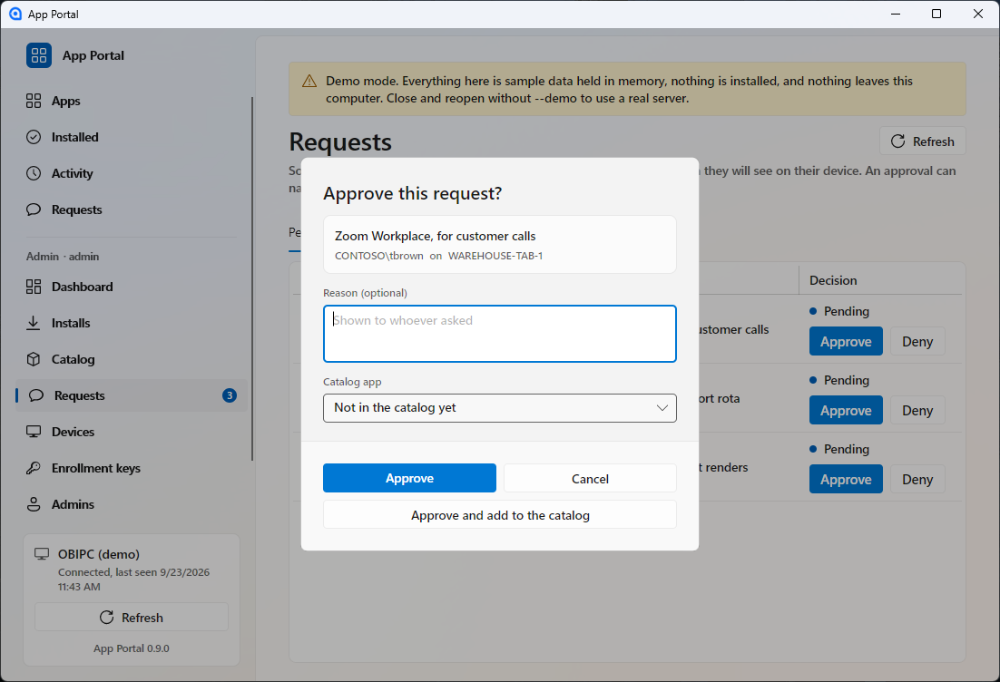 | 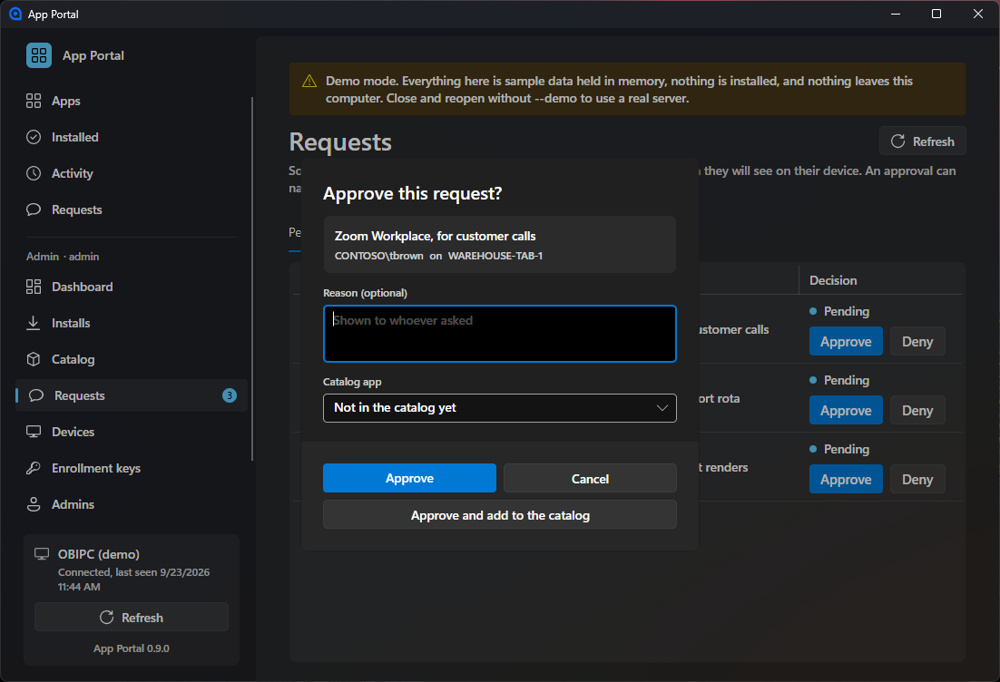 |
| 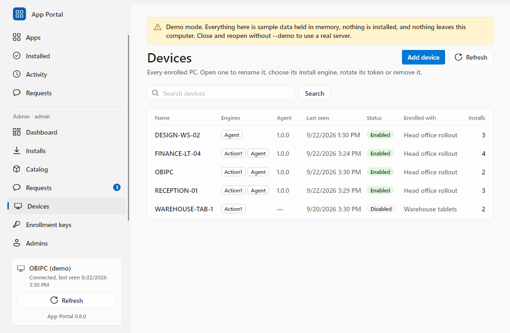 | 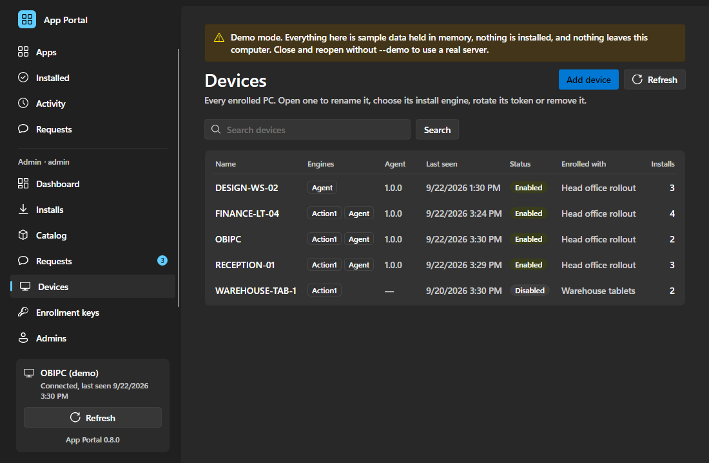 |

`AppPortal.exe --demo` opens the client with sample data held in memory; the demo administrator is `admin` with the password `demo`.

## The web admin pages

**Installs** shows fleet-wide history with device, requester, app, engine, state and dates. Filter by device, app, state, requester or date range; the table refreshes every 30 seconds.

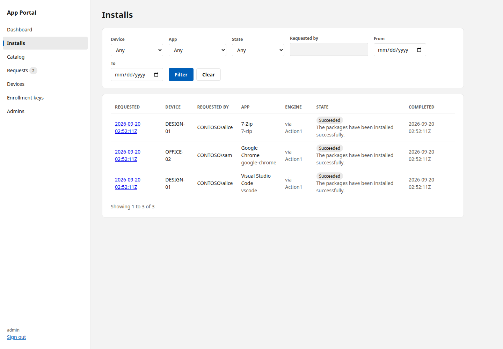

**Catalog** manages approved software. Edits appear in the client on its next refresh, including changes to existing cards.

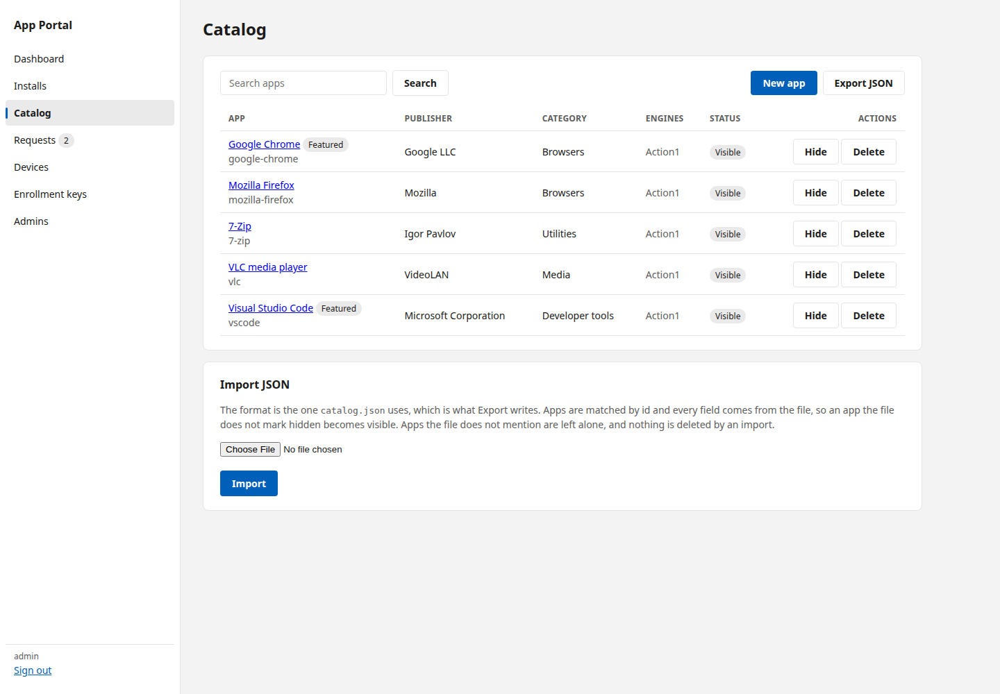

**Requests** shows pending and decided software requests. Approve or deny with an optional reason of up to 500 characters. An approval can name the catalog app that answers it, or open the create form prefilled from the request; the requester's client then offers that app. Approval never starts an installation.

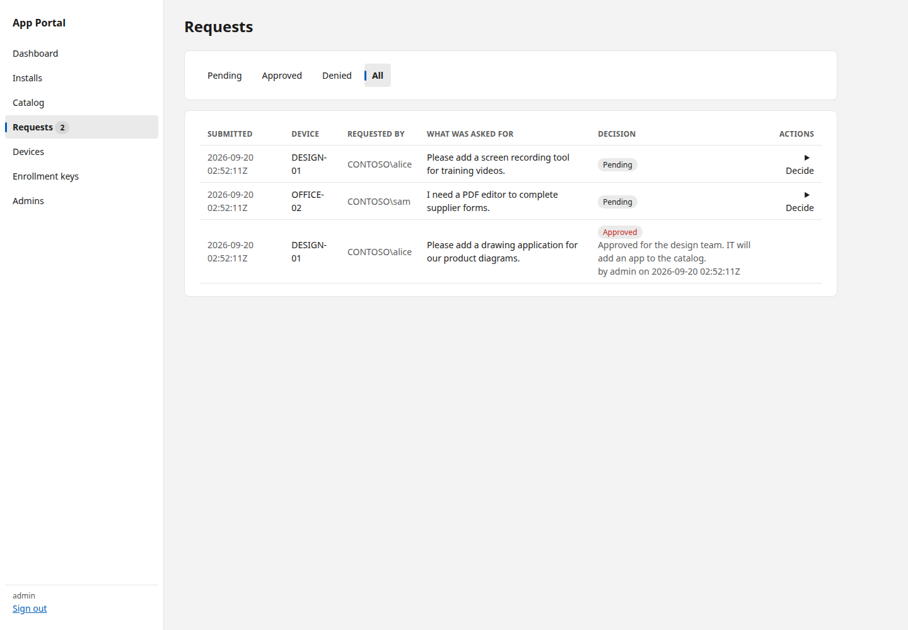

**Devices** supports renaming, disabling, token rotation and removal. Disabling or rotating a token takes effect on the next API call. Removal is refused while an install is active; afterward, install and request history remains available to administrators. A replacement device does not inherit the retired device's history.

A device with the agent also shows the package managers it has and the kernel **anti-cheat** it carries: Riot Vanguard, Easy Anti-Cheat, BattlEye, FACEIT, EA Javelin, PunkBuster, nProtect GameGuard, XIGNCODE3 and HoYoverse's, each service and driver with its state and how it starts. The agent reports them when its service starts and once a day. Games install these themselves, and the portal never starts, stops or changes one. A stopped piece that should start with Windows, or a disabled one, is marked: that is the usual reason a game will not start, and one installed a moment ago, such as Vanguard's driver, needs a restart first. Stopped on-demand services, which most of them are between games, are ordinary.

**Enrollment keys** lets administrators create and revoke keys with an expiry, use limit and default engine. The full key appears once.

## Requests from users

The client's **Requests** section accepts up to 500 characters describing the software needed. Each device can have 20 pending requests. The newest request appears immediately after submission; status and administrator reasons refresh with the rest of the client. When an administrator answers a request with a catalog app this PC is offered, the request shows **Show in Apps**, which opens Apps on that app so it installs from its card as usual.

| | |
|---|---|
| 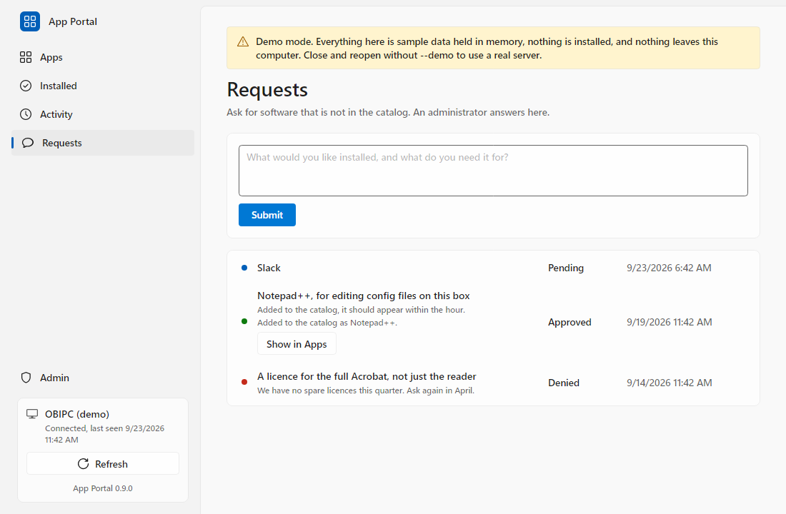 | 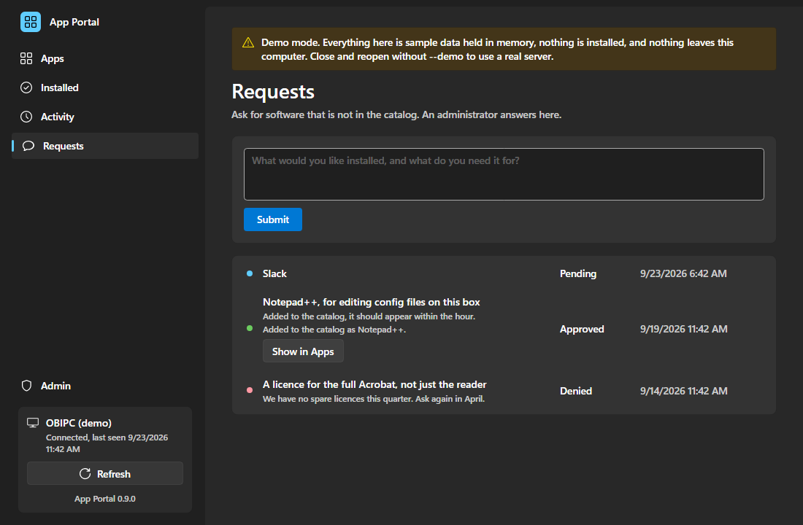 |

## Where an app comes from

An administrator adds an app by choosing its **Source** on the catalog page and naming the app there; the page shows only the fields that source needs, and a sentence under the form says what saving will do. The person installing it never sees which source it is.

| Source | What it is for | Installs for |
|---|---|---|
| Action1 | A package from your Action1 Software Repository, on a device with an Action1 endpoint. | Everyone |
| winget | Windows applications, from Microsoft's community repository. The default choice for most software. | Everyone, or one person |
| Microsoft Store | Store applications, by their twelve-character product id. Some need the person signed in to the Store before it grants a licence; say so under Requirements. | One person |
| Direct download | Any installer at a URL, checked against its SHA-256. Game launchers and vendor installers that are in no repository. | Everyone, or one person |
| Game launcher | A game in Steam, the Epic Games Launcher, GOG Galaxy or Ubisoft Connect, by the id the launcher uses. The agent opens the game's install page in the launcher on the person's own desktop, and they finish there with their own account. The card says where it opens. | One person |
| Portable app (zip) | A zip that runs from wherever it is unpacked, checked against its SHA-256: mod managers, monitoring tools, emulators, internal tools. The agent unpacks it into a folder of its own, adds a Start menu shortcut, and writes an uninstall entry, so it shows in Settings and in the portal's Installed list. Removing it takes all three away. | Everyone, or one person |
| Chocolatey | Windows applications and tools, from the Chocolatey community repository. The closest of these to winget. | Everyone |
| Scoop | Developer tools, into one person's profile without administrator rights. | One person, or everyone with `--global` |
| npm, Yarn | Node.js command line tools. Needs Node.js on the PC. | Everyone, or one person |
| Bun | Node.js packages through Bun. Needs Bun. | One person |
| pip | Python packages and the tools they bring. Needs Python. | Everyone, or one person |
| Cargo | Rust command line tools, built on the PC. Needs Rust. | One person |
| vcpkg | C and C++ libraries into a build tree. For developer machines, not for applications. | The PC |
| .NET tool | Command line tools published to NuGet. Needs the .NET SDK. | One person |
| PowerShell module | A module from the PowerShell Gallery, for PowerShell 7 or for the Windows PowerShell 5.1 every PC already has. | Everyone, or one person |

An app can have an Action1 package and one agent source at once; the catalog page then asks which to use on a device that could use either. Only Action1 and the next five are ways to put an application in front of everybody on a PC. The rest are for developer workstations: reaching for npm to deploy a web browser is a misunderstanding of what npm is.

The portal installs applications and launchers. What a launcher downloads for one signed-in account, a game in a Steam library or a Riot client's own updates, belongs to that launcher and that account. The portal can hand a game to its launcher, which opens the game's page there for the person to finish with their own account, but it never signs in to a launcher, never drives one, and never downloads a game itself.

To offer a game: add its launcher to the catalog, from winget (`Valve.Steam`, `EpicGames.EpicGamesLauncher`, `GOG.Galaxy`, `Ubisoft.Connect`), then add the game with the source **Game launcher**, its launcher, its id, and the launcher under **Requires**. Where to find the id:

| Launcher | The game's id |
|---|---|
| Steam | The number in the game's store address: `store.steampowered.com/app/730` is 730, Counter-Strike 2 |
| Epic Games Launcher | The app name the launcher uses, such as `Fortnite` |
| GOG Galaxy | The game's product id, the number in its gogdb.org address |
| Ubisoft Connect | The game's Ubisoft Connect id, the number in Ubisoft Connect's own shortcuts |

The install is finished when the launcher is open on the game. The game then appears under Installed at the next inventory sweep, like any software, because each launcher writes an uninstall entry for its games. Removing a Steam game opens Steam's own removal; the other launchers remove games themselves. Battle.net and the EA app document no link that opens a game's install, so they are offered as launchers only.

A package manager has to be on the PC before anything can be installed through it, and none of them are on a fresh Windows install. Add the manager itself to the catalog, from winget or a direct download, and list it under **Requires** on the apps that need it: the portal then installs it first, once, and skips it on every PC that already has it. An install through a manager the PC lacks fails with a sentence naming the manager, rather than an exit code.

A package id goes onto a command line, and npm, Yarn and Scoop are batch files that Windows runs through `cmd.exe`. The catalog therefore accepts only the characters a real package id uses for that manager, and refuses anything a command prompt would read as an instruction. Extra arguments are passed through as the administrator typed them.
